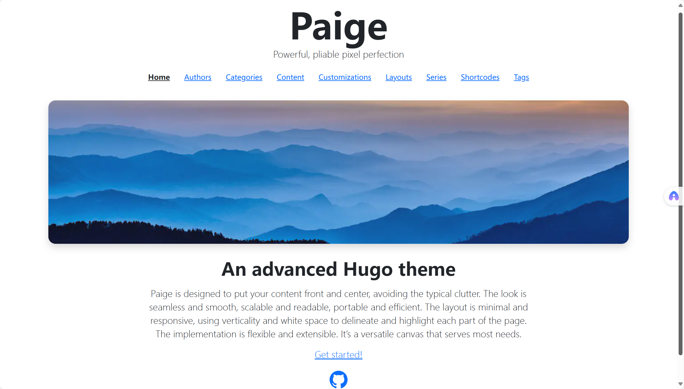
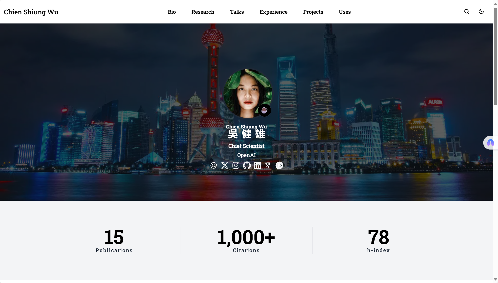

# 网站内容信息收集表

为了完善您的个人网站，请填写以下信息。您可以逐步提供，我会根据您的信息来定制网站。

---

## 📌 基本信息

### 网站标题与简介
- **网站名称**（当前：子柯的游乐场）：
- **网站副标题/标语**（可选）：
- **网站简介**（不同平台太割裂，我选择自己建站）：

### 个人信息
- **您的姓名/昵称**：
- **职业/身份**（不想被身份标签定义的人）：
- **个人简介**（暂时先空着）：

---

## 🎨 网站风格与主题

### 视觉风格偏好
- [1] 极简现代
- [ ] 专业商务
- [1] 创意艺术
- [ ] 技术极客
- [ ] 其他：__________

### 色彩偏好
- **主色调**（浅色系，简约但不冷酷，略带温暖的感觉）：

---

## 📝 内容板块

请勾选您想要在网站上展示的内容板块：

### 1. 博客/文章
- [ ] 小说
- [ ] 文章
- [ ] 代码
- [ ] 其他：摄影、播客（点击弹出下拉栏）

**初始文章**（请列出您想要发布的 3-5 篇文章标题）：
1. 
2. 
3. 
4. 
5. 

### 2. 作品集/项目展示
- [ ] 需要作品集页面

**项目信息**（如果需要，请列出 2-3 个代表性项目）：

#### 项目 1
- 项目名称：
- 项目简介：
- 技术栈：
- 项目链接（GitHub/Demo）：
- 项目截图/封面图：

#### 项目 2
- 项目名称：
- 项目简介：
- 技术栈：
- 项目链接：
- 项目截图：

#### 项目 3
- 项目名称：
- 项目简介：
- 技术栈：
- 项目链接：
- 项目截图：

### 3. 关于我页面
- [ ] 需要独立的"关于我"页面

**内容包含**：
- [ ] 个人经历
- [ ] 技能特长
- [ ] 教育背景
- [ ] 工作经验
- [ ] 兴趣爱好
- [ ] 个人照片/头像

### 4. 联系方式
请提供您希望公开的联系方式（可选）：

- **电子邮件**：
- **GitHub**：
- **LinkedIn**：
- **Twitter/X**：
- **微信**（二维码或ID）：
- **知乎**：
- **掘金**：
- **其他社交媒体**：

### 5. 其他页面
- [ ] 简历/CV 页面
- [ ] 时间线/里程碑
- [ ] 友情链接
- [ ] 标签云/分类归档
- [ ] 其他想法：__________

---

## 🔧 功能需求

### 基础功能
- [ ] 标签
- [ ] 阅读时间显示
- [ ] 文章目录（TOC）

### 增强功能
- [ ] 深色/浅色模式切换按钮
- [ ] 文章分享按钮
- [ ] 访问统计（Google Analytics / 百度统计 / 其他）
- [ ] 图表支持（Mermaid）
- [ ] 图片灯箱效果
- [ ] 文章系列/专题
- [ ] 置顶文章

---


## 🎯 优先级

请标注您最想先实现的功能（按 1、2、3 排序）：

1. 搭建网站整体框架
2. 完成大致的美学设置
3. 上传小说（其他板块暂时留空）

---

## 💡 其他想法

有任何其他想法、灵感或参考网站，请在这里描述：

- **参考网站**（您喜欢的网站样式）：
- **特殊需求**：
- **其他补充**：

---

## 📋 内容素材

### 已有内容
- [ ] 我已经有一些写好的小说（Markdown 格式，之后复制过来）


## ✅ 快速启动选项

### 选项 B：作品集网站
- 突出项目展示
- 包含：首页、作品集、项目详情、关于我、联系方式
- 视觉化设计，图文并茂

---

参考网站风格1：



网站链接（如果AI可以访问的话）：

https://willfaught.com/paige/


说明：

顶部是导航栏（但要换成我的内容）。此外，我希望网站首页能有每个板块的最新内容（按照发布时间排序），而不只是一个封面图。目前先只考虑小说板块，其他的暂时不用放


参考风格2：



网站链接：

https://hugo-academic-pages.netlify.app/

说明：左侧是网站logo，点击返回首页。中间是导航栏，右侧是搜索和夜间模式切换（暂时不考虑搜索功能，不用放图标，等之后做出来了再放）

---

## 🔍 需要补充的关键信息

### 导航栏设计
根据参考网站，请明确导航栏内容：

- **导航项 1**：首页 (Home)
- **导航项 2**：小说 (Novels / Stories)
- **导航项 3**：文章 (Articles) - 暂不启用
- **导航项 4**：代码 (Code) - 暂不启用
- **导航项 5**：其他 - 下拉菜单，包括摄影 、播客
- **导航项 6**：关于 (About) - 可选

**导航样式**：
- [ ] 顶部靠右，水平布局（类似参考网站，但不完全一样）
- [ ] 简洁文字链接，选中之后文字高亮并加入背景阴影表示当前页
- [ ] 响应式，移动端显示汉堡菜单

### 首页布局细节

**顶部区域**：
- [ ] 需要 Hero 横幅图片（类似参考网站的蓝色山景图）
  - 图片来源：
- [ ] Hero 区域文字内容：
  - 主标题：不显示，但网站名称是（Zinger's playground）
  - 副标题：不要副标题

**最新内容展示区**：
- 显示方式：
  - [ ] 列表式布局（纯文字 + 摘要）
- 显示数量：最新 2 篇小说（章节）
- 每篇显示信息：
  - [ ] 标题
  - [ ] 发布日期
  - [ ] 标签

### 小说板块页面结构
点进去应该有两个按钮：中长篇、短篇

**列表页 (`/novels/` 或 `/stories/`)**：
- 排序方式：
  - [中长篇] 按章节号（第一章在最前面）
  - [短篇] 按更新时间（第一次上传的更新时间是发布时间）
- 分页：每页显示 __5___ 篇
- 筛选功能：
  - [ ] 按标签筛选
  - [ ] 按年份筛选
  - [ ] 搜索框

**单篇小说页面 (`/novels/{title}/`)**：
- 顶部显示：
  - [ ] 标题
- 正文区域：
  - 字体：_________ （建议：宋体、思源宋体等适合长文阅读）
  - 字号：_________ （建议：16-18px）
  - 行距：_________ （建议：1.8-2.0）
  - 最大宽度：_________ （建议：650-750px，适合阅读，使用相对宽度，占屏幕90%，而不是具体像素值）
- 底部功能：
  - [ ] 发布日期 / 更新日期
  - [ ] 字数统计
  - [ ] 阅读时间
  - [ ] 标签
  - [ ] 分享按钮
  - [ ] 上一篇/下一篇导航
  - [ ] 返回列表链接
  - [ ] 评论区（暂不启用）

### 小说内容组织

**目录结构**：
```
content/
  novels/           # 小说板块
    _index.md      # 板块首页
    novel-1.md     # 单篇小说
    novel-2.md
  articles/        # 文章板块（暂不启用）
  code/           # 代码板块（暂不启用）
  photography/    # 摄影板块（暂不启用）
  podcast/        # 播客板块（暂不启用）
```

**小说命名规范**：
- 文件名格式：小说名称-章节（如：`2025-01-15-story-title.md` 或 `story-title.md`）
- URL 格式：_________ （如：`/novels/story-title/`）

### 视觉元素

**封面图**：
- [ ] 每篇小说支持专门封面图
- [ ] 没有指定则使用默认占位图，横版3:2。图片为：

**字体选择**：
- 标题字体：思源黑体_________ （建议：思源黑体、苹方等）
- 正文字体：宋体_________ （建议：思源宋体、宋体等）
- 代码字体：Code、Consolas_________ （建议：Fira Code、Consolas 等）

**色彩方案细化**：
参考 Paige 主题的蓝色系，请确认：
- 主色：_________ （如：#4A90E2 蓝色）
- 强调色：_________ （如：#FF6B6B 暖色用于链接悬停）
- 背景色：_________ （浅色：#FAFAFA，深色模式：#1A1A1A）
- 文字色：_________ （浅色模式：#333333，深色模式：#E0E0E0）

我找到一组配色：我觉得很不错，可以如何运用到我的网站中？
- #2C3639 - 深灰蓝（最深）→ 建议用于：深色模式背景、导航栏背景
- #3F4E4F - 中灰绿（次深）→ 建议用于：按钮背景、悬停效果、边框
- #A27B5C - 暖棕色（中间）→ 建议用于：链接色、强调色、选中状态
- #DCD7C9 - 浅米色（最浅）→ 建议用于：浅色模式背景、卡片背景

**配色应用方案**：
- **浅色模式**：
  - 背景：#DCD7C9（米色）或 #FFFFFF
  - 导航栏：#DCD7C9 或半透明白色
  - 文字：#2C3639（深灰蓝）
  - 链接/强调：#A27B5C（暖棕）
  - 链接悬停：#3F4E4F（中灰绿）
  - 选中背景：#A27B5C + 20% 透明度
  
- **深色模式**：
  - 背景：#2C3639（深灰蓝）
  - 导航栏：#3F4E4F（中灰绿）
  - 文字：#DCD7C9（浅米）
  - 链接/强调：#A27B5C（暖棕）
  - 选中背景：#A27B5C + 30% 透明度

### 响应式设计

**断点设置**：
- 移动端（< 768px）：单列布局
- 平板（768px - 1024px）：_________ 
- 桌面（> 1024px）：_________

**移动端特殊考虑**：
- [ ] 导航栏折叠成汉堡菜单
- [ ] 首页 Hero 图片优化
- [ ] 字体大小自适应
- [ ] 触摸友好的按钮尺寸

### Footer 页脚

**内容包含**：
- [ ] 版权信息：© 2025 子柯的游乐场
- [ ] 社交媒体图标链接（如有）

---

## 🎯 需要明确的技术细节

### 网站 Logo
根据参考网站 2，左侧有网站 logo：
- **是否需要 Logo 图标**：是 / 否
- **Logo 类型**：
  - [ ] 文字 Logo（"Zinger's playground"）
- **Logo 点击行为**：返回首页 ✓

### 深色模式切换
参考网站 2 右上角有深色模式切换按钮（月亮/太阳图标）：
- **是否需要深色模式切换按钮**：是
- **切换按钮位置**：导航栏右侧 ✓
- **默认模式**：
  - [1] 浅色模式

### 下拉菜单交互
"其他"导航项包含下拉菜单（摄影、播客）：
- **下拉触发方式**：
  - [ ] 鼠标悬停展开
- **下拉菜单样式**：
  - [ ] 简单列表
- **下拉动画**：淡入

### 小说板块详细结构

**中长篇小说组织**：
- 一部中长篇小说有多个章节
- 章节按顺序排列（第一章在最前）
- **需要的页面结构**：
  1. `/novels/` - 小说列表页（显示所有小说作品）
  2. `/novels/中长篇/` - 中长篇分类页（显示中长篇小说列表）
  3. `/novels/短篇/` - 短篇分类页（显示短篇小说列表）
  4. `/novels/[小说名]/` - 单部小说的章节列表页（仅中长篇需要）
  5. `/novels/[小说名]/[章节名]/` - 单个章节阅读页

**小说列表页显示内容**：
每部小说显示：
- [ ] 小说封面图（3:2 横版）
- [ ] 小说标题
- [ ] 简介/简短描述
- [ ] 类型标签（中长篇/短篇）
- [ ] 最新章节/更新时间
- [ ] 章节数量（仅中长篇）

**章节列表页（中长篇专用）**：
- 显示小说封面和简介
- 按章节号排序的章节列表
- 每个章节显示：
  - [ ] 章节号
  - [ ] 章节标题
  - [ ] 发布日期

### 内容元数据（Front Matter）

**中长篇小说章节需要的字段**：
```yaml
---
title: "章节标题"
novel: "所属小说名称"
chapter: 1
creatdate: 2025-01-01
update: 2025-01-30
draft: false
tags: ["标签1", "标签2"]
type: "novels"
category: "中长篇"
---
```

**短篇小说需要的字段**：
```yaml
---
title: "短篇标题"
creatdate: 2025-01-01
update: 2025-01-30
draft: false
tags: ["标签1", "标签2"]
type: "novels"
category: "短篇"
description: "简短描述"
cover: "封面图路径（可选）"
---
```

### 默认占位图处理
您提到的默认占位图 `1761810583916.jpg`：
- **使用场景**：当小说没有指定专门封面时
- **图片处理**：
  - [ ] 添加渐变遮罩 + 小说标题文字
- **是否需要多个占位图**：不需要

### 移动端导航栏
导航栏在移动端折叠成汉堡菜单：
- **汉堡菜单位置**：
  - [ ] 左上角
- **展开方式**：
  - [ ] 从左侧滑入
- **菜单样式**：浅色模式下浅色背景 + 深色文字，深色模式下深色背景+浅色文字

### 标签系统

- **预设标签列表**（请列出您常用的标签）：
  1. 科幻
  2. 人文
- **标签页面**：是否需要 `/tags/` 页面显示所有标签？是
- **标签筛选**：是否在小说列表页支持按标签筛选？否

### 阅读进度（可选功能）
- **是否需要记住用户阅读位置**：暂不考虑

### 图片资源管理
- **图片存储位置**：
  - [ ] `/static/images/novels/` - 小说封面
  - [ ] `/static/images/hero/` - Hero 横幅
  - [ ] `/static/images/default/` - 默认占位图
- **图片格式**：JPG / PNG / WebP（推荐）
- **是否需要图片压缩优化**：是

### 技术实现偏好

**是否使用现成主题作为基础**：
- [ ] 选项 2：参考风格，完全自建主题（更灵活）


**原因/补充说明**：其他网站的模板不是很好看

---

## ✅ 下一步行动计划

根据您填写的信息，我建议的实施步骤：

### 阶段一：基础框架（1-2天）
1. 更新主题样式，实现类似 Paige 的极简布局
2. 配置导航栏（首页 + 小说）
3. 创建小说内容类型和模板
4. 设置首页显示最新小说列表

### 阶段二：视觉优化（1天）
1. 添加 Hero 横幅区域
2. 优化色彩方案（浅色系 + 温暖感）
3. 调整字体和排版（适合小说阅读）
4. 响应式布局测试

### 阶段三：内容上线（按需）
1. 创建小说内容模板
2. 迁移您的小说内容
3. 添加标签和元数据
4. 最终测试和部署

**是否同意此计划**：是 / 否 / 需调整

**调整建议**：_________

---

## 📌 最后确认：还需补充的细节

### 网站名称确认
- **中文名**：子柯的游乐场
- **英文名**：Zinger's Playground
- **Logo 文字**：使用英文 "Zinger's Playground" , 简写 "ZK" 
  - 桌面版显示完整英文，移动端显示简写

### Hero 横幅图片尺寸
您提供的 Hero 图片（海边山景）：
- **建议尺寸**：1920x600px（桌面）、768x400px（移动端）
- **Hero 高度**：不要占据全屏，只占大部分高度，留出一些空间
- **图片上文字**：参考网站2，单独放出来，加一个蒙版，不要叠加任何文字

### 小说阅读页字体细节
- **正文字号**：建议 17px（桌面）、16px（移动端）
- **行距**：建议 1.8
- **段落间距**：建议 1.5em
- **最大宽度**：建议 680px 或屏幕宽度的 85%（取较小值）
- **字体颜色**：
  - 浅色模式：#2C3639（深灰蓝）
  - 深色模式：#DCD7C9（浅米色）

### 导航栏具体实现
- **导航栏高度**：60px
- **Logo 位置**：左侧距离边缘（建议 2rem）
- **导航项间距**：建议 2-3rem
- **导航栏背景**：
  - 导航栏并不始终处于屏幕顶端，滚动之后就离开屏幕

### 小说列表展示方式
在 `/novels/` 主页和分类页，小说卡片排列：
- **布局方式**：
  - [x] 单列列表（每行一个）- 移动端
  - [x] 两列网格（中等屏幕+）- 桌面端
- **卡片样式**：
  - [x] 带阴影的卡片
- **卡片内容**：
  - 封面图（左侧或顶部）
  - 标题 + 简介
  - 类型标签（中长篇/短篇）
  - 更新时间/章节数

### 中长篇小说章节管理
对于一部中长篇小说（如《XXX》），文件组织方式：

- **方式 B**：使用 Hugo 的 Page Bundle
  ```
  content/novels/小说名/
    index.md        # 小说主页（包含章节列表）
    chapter-01/
      index.md
    chapter-02/
      index.md
  ```
- **您的偏好**：方式 B

### 首页最新内容显示
首页显示"最新 2 篇小说（章节）"：
- **显示逻辑**：✓ 显示最新更新的 2 部小说 + 各自的最新章节标题
- **展示格式**：
  - 列表式布局
  - 显示：小说标题 / 最新章节标题 / 更新日期 / 标签

### 小说封面图规范
- **推荐尺寸**：900x600px（3:2）
- **文件大小**：< 500KB（经过压缩）
- **命名规范**：`小说名-cover.jpg`
- **存放位置**：`/static/images/novels/小说名/cover.jpg`

### 404 页面
当前有基础的 404 页面，是否需要美化：
- **内容**：
  - "页面走丢了" 
  - 返回首页链接
- **风格**：与整体风格一致的极简设计

### 加载动画
页面切换时是否需要加载动画：
- [x] 简单的淡入淡出（页面加载时内容淡入）

### 性能优化
- **图片懒加载**：是否启用？（是）
- **字体加载策略**：
  - 使用系统字体（无需加载）
- **CSS/JS 压缩**：启用（Hugo 自动处理）

### 浏览器兼容性
- **目标浏览器**：
  - 现代浏览器（Chrome、Firefox、Safari、Edge 最新版）
  - 是否需要兼容 IE11：否

### SEO 元标签
每篇小说需要的 SEO 信息：
- **description**：从正文提取前 150 字
- **keywords**：使用标签作为关键词
- **og:image**：使用封面图（如有）或默认图

---

## ✅ 可以开始实施了！

根据您目前填写的信息，已经足够开始搭建了。以上补充的细节可以在实施过程中逐步确定和调整。

**如果您同意，我现在就开始按以下顺序实施**：

### 第一步：更新网站配置和主题基础结构
1. 更新 `config.toml`（网站名称、导航菜单、配色变量）
2. 重构主题 CSS（应用您的配色方案）
3. 创建新的导航栏（带 Logo、深色模式切换）
4. 添加 Hero 横幅

### 第二步：创建小说内容类型
1. 配置小说内容类型（novels）
2. 创建小说列表模板
3. 创建小说阅读页模板
4. 创建章节列表模板（中长篇）

### 第三步：创建示例内容
1. 创建一个短篇示例
2. 创建一个中长篇示例（2-3章）
3. 测试所有页面和功能

**是否开始实施？或者您还有其他需要补充/调整的？** 😊

---

## 🎨 最后补充：一些实施细节

### "中长篇/短篇" 分类按钮
在 `/novels/` 页面顶部的两个按钮：
- **样式**：类似标签页切换
- **位置**：页面标题下方，居中显示
- **交互**：点击切换显示不同分类的小说列表
- **实现**：使用 Hugo 的分类功能（taxonomies）或简单的 JavaScript 筛选

### 短篇小说页面结构
短篇没有章节列表页，直接是：
- `/novels/短篇小说标题/` - 直接显示全文（使用 single.html 模板）

### 中长篇小说页面结构  
中长篇有章节，层级为：
- `/novels/中长篇小说标题/` - 显示小说简介和章节列表（使用 list.html 模板）
- `/novels/中长篇小说标题/第一章/` - 显示章节内容（使用 single.html 模板）

### 导航栏"小说"菜单项行为
点击"小说"导航项：
- **跳转到**：`/novels/` 页面（显示所有小说，带中长篇/短篇切换按钮）

### "其他"下拉菜单
暂时包含：
- 摄影（链接到 `/photography/` - 暂时显示"敬请期待"）
- 播客（链接到 `/podcast/` - 暂时显示"敬请期待"）

### 深色模式实现方式
- 使用 CSS 变量 + `prefers-color-scheme` 媒体查询
- JavaScript 控制用户手动切换
- LocalStorage 记住用户选择

### Hero 图片蒙版效果
参考网站 2 的方式：
- 图片上方添加渐变蒙版（从透明到半透明黑色）
- 或使用柔和的模糊效果
- 确保图片不会太抢眼，突出内容

---

## ✅ 信息收集完成！可以开始实施了！

所有关键信息已经确定：
- ✅ 网站名称和 Logo
- ✅ 色彩方案（4色配色）
- ✅ 导航栏设计
- ✅ Hero 横幅
- ✅ 小说内容结构（中长篇/短篇）
- ✅ 页面布局和样式
- ✅ 响应式设计
- ✅ 功能需求

**准备好了吗？我现在开始实施！** 🚀
