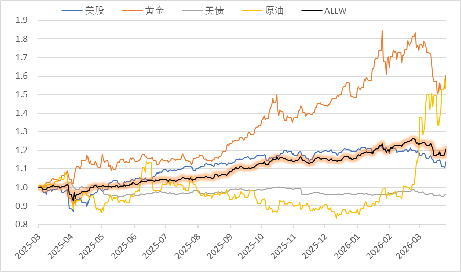
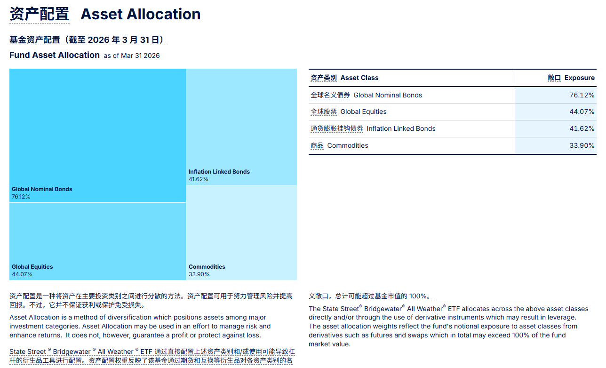
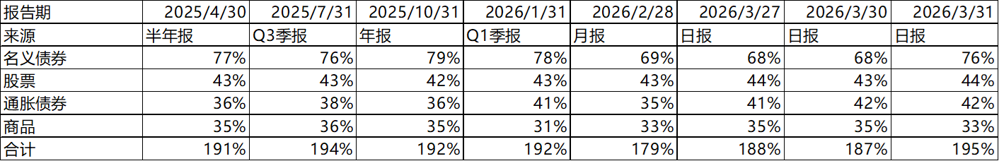
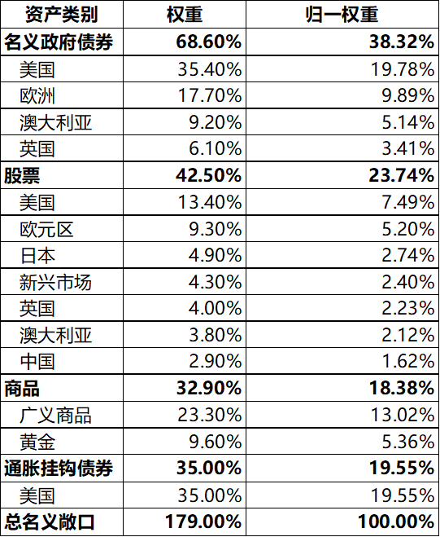
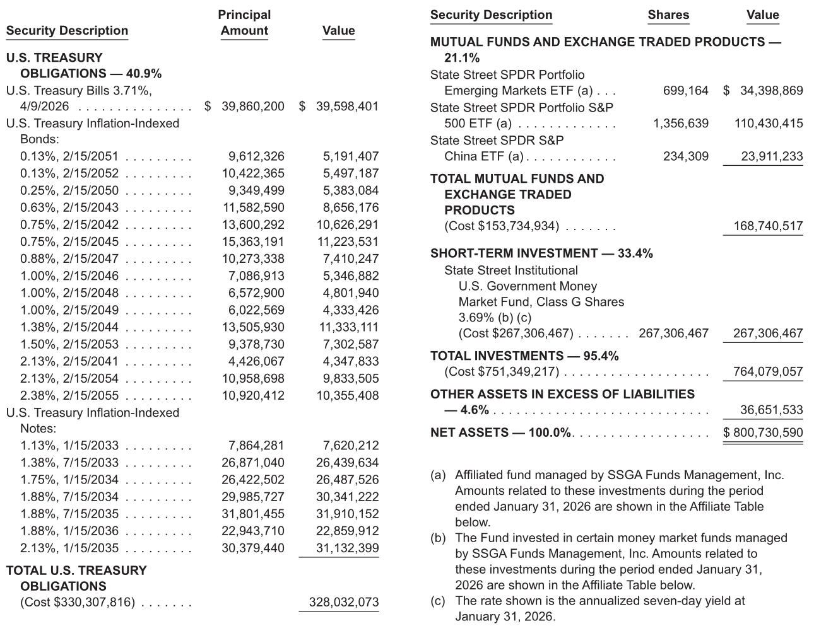
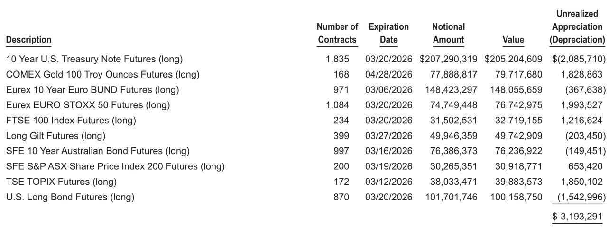
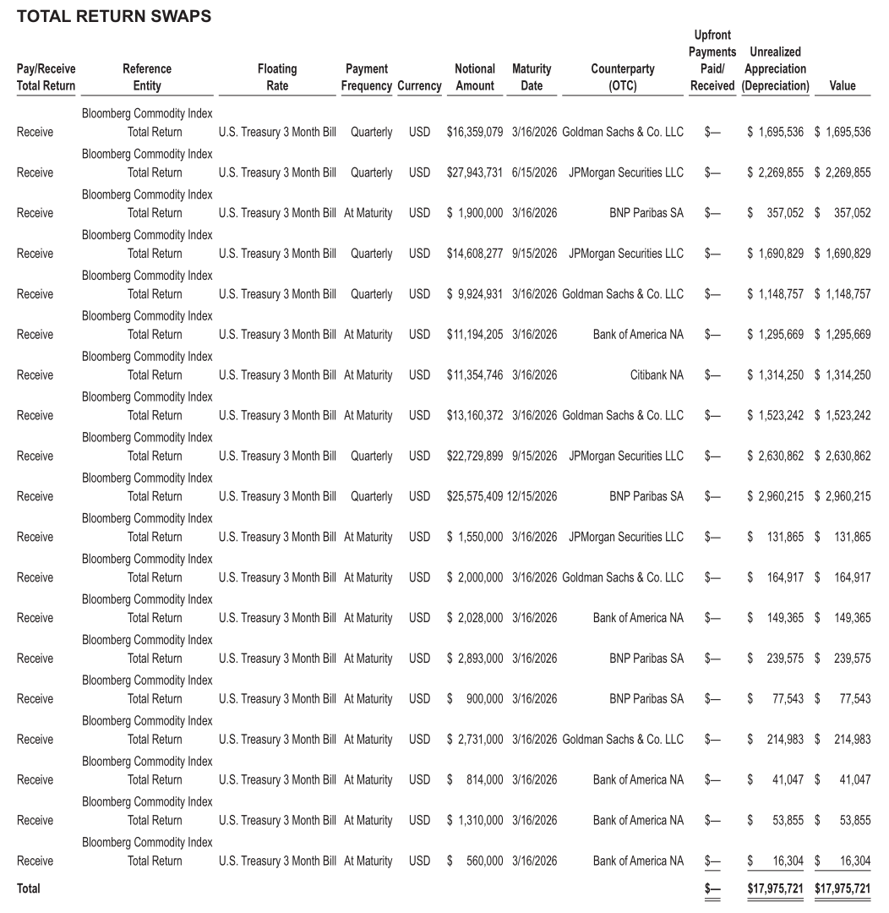

我原以为全天候策略就是一个简单的分散配置模型，按比例搭配几个大类资产即可。拆开桥水全天候ETF的真实持仓后，才发现它比想象中复杂得多。

表面上看，全天候是一套"大类资产平衡配置"的思路；但拆到底层后，你会发现，它实际上是一套相当复杂的风险工程。它平衡的不是资金，而是风险；它依赖的不只是几个大类资产现货搭配，而是现货、ETF、期货、互换、杠杆共同配合的一整套实现方式。

这也是我拆完全天候持仓，最深的感受：**全天候并不是一个“股债商品平均配置”的简单配方，而是一套量化投资策略，是比想象中复杂得多的风险平衡系统。**

---

## 一、全天候，到底想解决什么问题？

桥水基金在 2012 年的文章《[全天候的故事](https://www.bridgewater.com/research-and-insights/the-all-weather-story)》里，对这套策略做过系统介绍。

它背后的核心出发点很朴素：**不妄图预测未来，而只是做好准备。**

桥水将宏观环境拆成两个维度：**增长** 和 **通胀**。这两个维度各自都可能高于预期，也可能低于预期，于是就形成了四种典型环境：

|  | 通胀高于预期 | 通胀低于预期 |
| --------------| ----------------| ----------------|
|增长高于预期|商品更受益|股票更受益|
|增长低于预期|通胀债券更受益|名义债券更受益|

桥水全天候要做的就是：**尽量对上面四种情况都做好准备，而不是偷偷押注某些情形。**

如果一个组合只在“低通胀”的环境下表现好（传统的股票+债券组合），并不能算全天候；只有在各种情形下都能保持稳定的资产组合，才是全天候策略追求的目标。

> 补充通胀债券的基本知识：通胀挂钩债券将债券的本金与通胀挂钩，因此当物价上升，债券的本金也会增加，在利率不变的情况下，票息会同步增长。最早的成熟样板来自英国1981年发行的债券，美国则于1997年首次发行通胀债。通胀债券占主权债券的比重约3%，截止2025年已有美国、加拿大、英国、法国、墨西哥、巴西、哥伦比亚、智利等超过20个国家发行，均挂钩各自国家的通胀指数。中国内地没有（但香港有）。资料来自GPT整理。

---

## 二、全天候ETF的表现如何？

网络上介绍全天候的文章很多，还有很多人做了回测。但真正的问题是：**这套策略到底是怎么落地的？**

外界长期只能靠推测，因为桥水并没有完整公开配方。直到 2025 年 3 月，纳斯达克上市了一只ETF：[ALLW](https://www.ssga.com/us/en/intermediary/etfs/state-street-bridgewater-all-weather-etf-allw)，桥水全天候ETF。自成立以来一年零一个月左右，总回报率20.74%，年化波动率12.9%，最大回撤7.27%。

图：桥水全天候ETF及其他主要资产行情（2025-03-06至2026-03-31）

如果你对ALLW感到满意，你可以直接在纳斯达克买入桥水全天候ETF（这句话不构成投资建议）。但要注意，ETF的成本并不低，比大多数ETF都贵，招股书里写的年化管理费是0.85%（通常被动ETF费率0.15%，主动股票ETF费率0.5%，复杂的多资产另类ETF费率通常也就0.5%-0.65%）。

此外还有交易成本等隐形费率。最近的年报（从2025/3/6到2025/10/31，总共8个月）显示，基金换手率约99%，交易手续费没有单独列示，但会直接降低基金净值表现。

---

## 三、全天候ETF真实持仓一撇

这只ETF的意义不只是“可以购买”，更重要的是，它非常主动地在产品官网公布了自己的完整持仓，为外界了解全天候策略提供了非常珍贵的窗口。另外，达利欧在2026年3月24日的文章《[全天候投资组合的概念与机制](https://raydalio.substack.com/p/the-concept-and-mechanics-of-an-all)》里说他很快会将配方整理出来，可以期待一下。

先看它的大类资产敞口（更详细的底层持仓在后面）。

如果按照各类资产对净资产的原始敞口来算，它的总敞口195%，说明它用 100块钱，持有195元的资产，加了接近1倍的杠杆。把各类资产敞口归一化后，大致可以得到这样的结构：

|资产类别|原始敞口|归一化敞口|
| --------------| ----------| ------------|
|全球名义债券|76.12%|38.89%|
|全球股票|44.07%|22.52%|
|通胀挂钩债券|41.62%|21.27%|
|大宗商品|33.90%|17.32%|
|合计|195.71%|100.00%|

这张表首先说明了一件事：**全天候并不是平均配置四类资产。**

全天候真正的精髓在于，它关注风险比例，而不是资金比例。大多数的资产配置策略会框定某项资产占总资产的比例（例如股票60%-80%、债券20%-40%），但全天候不会刻意关注资产的资金占比。ALLW在产品宣传页和招募书的说明是：

> ALLW 旨在平衡对关键经济环境具有不同敏感性的资产，而**不预测未来会出现哪种环境**，这意味着**风险被平均分配到不同的增长和通胀环境中。**
>
> 根据本基金的投资子顾问 Bridgewater Associates, LP（简称“子顾问”或“Bridgewater”）提供的模型组合进行资产投资，以实现基金的投资目标。该模型组合包含提供不同市场和资产类别风险敞口的证券及工具，其配置比例旨在构建一个在各种市场状况和环境下均具备韧性的整体投资组合。该模型组合直接和/或通过使用衍生工具获得对不同资产类别的多头和空头头寸，且**对任何单一资产类别的风险敞口均不设上限或下限**。

那么，这个风险比例是怎么来的呢？ALLW和桥水都没有明说。我根据公开信息，做了些推算。

---

## 四、全天候策略建模

根据相关的公开信息（和GPT的帮助），大致可以推断桥水的配置思路：

- 先给每资产估一个 **增长敏感度（g）**  和 **通胀敏感度（π）**
- 再找一组权重，使得组合整体的增长暴露接近 0、通胀暴露接近 0
- 再把组合总波动调到目标区间
- 最后用现货、期货、互换去实现

回到上面的四种主要资产，我们可以粗略地假设，各类资产对增长和通胀的敏感度如下（这组数据是我为了举例而随手写的）：

|**类型**|**增长敏感度（g）**|**通胀敏感度（π）**|
| -----------| ------| ------|
|商品c|+1|+1|
|股票s|+1.3|-0.5|
|名义债券n|-0.3|-0.5|
|通胀债券i|-0.2|+1|

它大致符合直觉（和桥水对资产的理解）：

- 商品同时受益于增长和通胀上行
- 股票更偏增长资产，但怕高通胀
- 名义债券偏向低增长、低通胀环境
- 通胀债券主要承担通胀保护功能

我们可以算出，为了实现全天候平衡，最佳的投资组合需要满足：

1）增长暴露为 0

$$
1\cdot w_c + 1.3\cdot w_s -0.3\cdot w_n -0.2\cdot w_i = 0
$$

2）通胀暴露为 0

$$
1\cdot w_c -0.5\cdot w_s -0.5\cdot w_n +1\cdot w_i = 0
$$

3）归一化总权重为 100%（资产只能是这四类）

$$
w_c+w_s+w_n+w_i=1
$$

聪明的你一眼就可以看出来，3个条件解4个未知数是没有唯一解的。我们可以任意指定其中一种资产的比例（比如通胀债券），剩下三个会被联动确定。这个方程组的通解是：

$$
w_i=t
$$

$$
w_c=\frac{1}{3}-t
$$

$$
w_s=\frac{3}{4}t-\frac{1}{12}
$$

$$
w_n=\frac{3}{4}-\frac{3}{4}t
$$

假设通胀债券配25% (t=25%)，可以得到

- 商品：8.33%
- 股票：10.42%
- 名义债券：56.25%
- 通胀债券：25.00%

就算在一个极简模型里，全天候的自然结果也不是“四类资产平均配置”，而是很容易出现“**债券权重大幅高于股票和商品**”的结构。

但桥水肯定不能像我这样假设一个结果。他们是如何处理的呢？

他们引入了新的约束条件：**波动率**。

金融常识告诉我们，债券的波动率和收益率都弱于股票，增加债券比例会导致波动率和收益率都更低。于是根据人对波动的承受度，可以选择一个合适的水平，既不太高（大起大落受不了）也不太低（收益太低没有钱）。而债券的波动率可能过于低，因此在实践中不得不引入一定的杠杆来加强债券的对冲效果。

ALLW在说明书里说：**模型投资组合的目标年化波动率水平通常在 10%-12% 之间**。但为什么是这个波动率，没有更多解释。

有读者可能会好奇，是否可能通过桥水公布的历史持仓，反向推算前面假设的增长敏感度和通胀敏感度呢？

使用上图所示的历史仓位数据，我们可以（再次借助GPT）大致估算出桥水模型的风险因子值

|  | **增长敏感度（g）** | **通胀敏感度（π）** |
| -----------| -------| -------|
|商品c|1.00|1.00|
|股票s|1.19|-0.47|
|名义债券n|-0.49|-0.85|
|通胀债券i|-0.30|1.02|

需要注意，因为缺少其他必要的数据，**该结果几乎可以视为我瞎猜的，不代表任何桥水或ALLW的观点**。

事实上，真正重要的问题不是资产配比为多少，而是各资产的敏感度究竟是多少（有敏感度数据才能真正复刻该策略）。我试图测算，但发现难度远高于想象。感兴趣可以关注催更。

---

## 五、再次深入观察ALLW持仓

上面的数学，只是把逻辑讲清楚。真正让我确认“全天候比想象中复杂得多”的，还是底层持仓。现在看看他们如何实现资产配置的（散户想直接抄作业基本没可能）。

ALLW持有的资产包括：

- 全球名义债券：美债 + 美/德/英/澳国债期货
- 全球股票：标普500ETF + 新兴市场ETF + 中国ETF + 欧/日/英/澳股指期货
- 通胀挂钩债券：美国TIPS
- 大宗商品：黄金期货 + Bloomberg商品指数互换

2026/2/28的月报里，ALLW披露的各类资产占比如下：

在最新披露的2026/01/31季报，我们可以更详细地观察底层资产。虽然时间点和月报不同，但差异不大，不影响理解。

现货部分，核心是美债/TIPS + 3只股票ETF + 政府货币基金，可以看到，大约持有3.3亿美元的美债，1.1亿美元的美股、2400万美元的中国股票、3400万美元新兴市场股票。

期货部分，持有美债、黄金、其他国家的股票、债券等，美债的名义总量是2.1亿美元，黄金0.8亿，德国债券1.5亿等。

同时还持有一揽子商品互换SWAP，都是挂钩的彭博商品总回报指数。总共19笔，大约持有1.69亿美元的商品敞口，交易对手包括高盛、JP摩根、美国银行、花旗、法巴等。

> 彭博商品总回报指数：彭博对全球主要商品期货，按照流动性（占2/3）和生产总值（占1/3）进行加权，得到一篮子商品期货指数回报，并假设投资人将保证金投资于13周（3个月）美国国库券得到的总回报。截止2026年2月，指数成分包括：能源31.49%、农业27.96%、工业金属14.79%、贵金属20.42%、牲畜5.35%。
>
> 在操作上，ALLW 并不直接持有这些商品，也不必支付保证金，而是与高盛等对手方签订总收益互换：按约定名义本金，ALLW向对手方支付利息（按三个月美债利率计算），并收取彭博商品总回报指数的回报，中间不涉及任何实物交割。若商品指数涨幅超过同期利率，高盛需要向ALLW付钱，若商品指数下降，ALLW还要再额外倒贴。

‍

---

## 六、它看起来中性，其实仍然深度依赖美元体系

很多人看到“全天候”这三个字，会下意识觉得它很中性、很普适，像是一套放之四海而皆准的框架。

但拆开之后，我反而得到了一个相反的感受：**它没有押注某一种宏观环境，却仍然深度押注了某一套金融体系。**

从资产分布看，ALLW 虽然做了全球配置，但美国资产依然占据核心位置。以归一权重计，美国资产占46.8%，欧洲地区资产占比也有28%，而日本+新兴市场+中国的资产占比只有6.76%。商品占据剩余的18%。

ALLW当前的资产配置非常依赖于美国资本市场和政府正常运转。美债需要政府偿还，通胀债需要政府定期统计CPI，股票和期货很多在美国交易，商品的交易对手也大多是美国公司。这意味着，ALLW 的“全天候”成立，有一个默认前提：**美国金融市场正常运转，美元体系继续维持其中心地位。**

但这个前提还会继续成立吗？达利欧会如何介绍这个组合的风险呢？

按照达利欧的分析，美国正在衰落，中国正在崛起，未来美国有可能像曾经的荷兰、英国那样没落，美元甚至有可能变得一文不值（在大周期中，这种可能性并不为0）。最近达利欧的文章《[一切归结于谁能控制霍尔木兹海峡：“最终之战”](https://raydalio.substack.com/p/it-all-comes-down-to-who-controls)》提到，如果美国无法获得霍尔木兹海峡的控制权，全世界都将重新认识美国（并可能导致帝国的瓦解，就像1956年苏伊士运河危机对英国的作用，类似的失败在18世纪对荷兰帝国、17世纪对西班牙帝国也曾发生过）

通胀债的历史只有不到50年，如果真的发生了恶性通胀，政府是否会履行承诺，按照通胀率增加自己的债务负担？（尤其是考虑到那时的财政状况可能已崩溃）政府是否还有能力统计CPI数据（并保证数据的可靠性）？在国家内乱中交易所是否还能正常开市？商品互换的交易对手是否会继续履约？交易所是否还能保存投资人的数据（而不会因为某些原因查不到所有权凭证）？

当然，桥水的全天候暂时也不打算应对如此罕见的巨变，他们的目光在未来二十年而非两百年。在《全天候的故事》中，桥水写到：All Weather 源于桥水为理解世界所做的努力，即构建一个如今的投资组合，即便没人能预测未来二十年哪种增长与通货膨胀形态会占上风，依然能表现得相当不错。

也许这些意外在20年内都不会发生，也许这样的宏观风险当前活着的人都不会遇到，但也许......

---

## 七、回到达利欧：全天候真正值得普通人学的是什么？

我一直很欣赏达利欧，不只是因为他创立的桥水基金，也因为他研究问题的尺度很大。

他长期研究王朝周期、长债务周期、货币秩序更迭等。这些周期跨度太大，普通人一生只可能经历一次（甚至一次也没有）。在这样的视角下，一个自然的结论就是：

**人不可能稳定地预测未来。**

既然如此，一个着眼长久的投资体系，重点就不应该是“赌哪一种未来最可能发生”，而是**对未来的各种可能都平衡地做好准备。**

这件事说起来很简单，做起来却远比想象中复杂。

它不是四类资产平均配置。  
它平衡的是风险，而不是资金。  
它依赖杠杆和衍生品实现。  
它也因此不可能被简化成一句“股债商品分散配置”就讲完。

所以，如果一定要用一句话总结我拆完 ALLW 之后的感受，那就是：

**全天候不是一个简单配方，而是一套高度工程化的风险平衡系统。**
