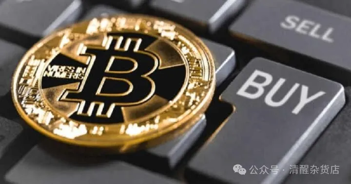
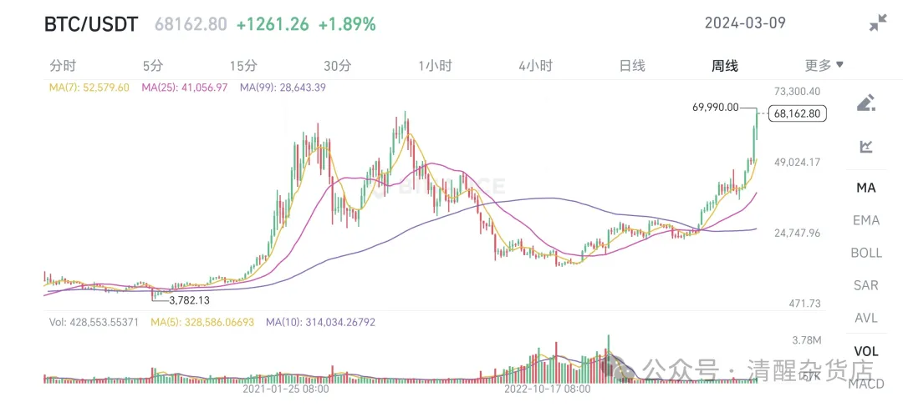

最近比特币又涨上新高，看到网上不少人说自己如果当年能囤xx个比特币，现在就可以成为亿万富翁了。

图片来源：自己截的

以前自己也这样想过，那还是在2021年，比特币的上一轮高峰，也是大约6万美元（40w人民币）。当时就幻想，如果自己初中（2014年左右）第一次听说比特币的时候，能多费点功夫，探索一下，用家里的旧电脑挖矿，或者攒点零花钱买几个币收藏，到现在也轮到我发财了！当时还看到有报道说某大佬花了超多个币（后来查过，约10000比特币）买了个披萨，算是给比特币进行了第一次市场定价。

但在二级市场这几年的经历告诉自己，就算当初真的攒了一些比特币，也轮不到自己赚钱。因为格局和认知不够。

2018年初在券商开户，此前还在支付宝买基金，算算到现在也有6年时间，穿过牛熊之后发现，人真的只能赚到自己格局和认知内的钱，超过的部分，凭运气赚来的钱都会凭本事亏出去。

印象特别深的是，2018年初我刚在平安证券开户，啥也不懂的时候，就随手挑了一家公司买入（回头查了下，是方正科技），买它主要是股价低，一手只要几百块，资金压力小。结果买入以后就开始下跌，让我心里很慌，于是没几天就卖了，不但亏了股票下跌的钱，还亏手续费（买进5块，卖出5块）。

此外自己2018年初开户进场没多久，就看到特朗普发起贸易战的新闻，然后A股一路下跌，带来的亏损给并不富裕的穷学生留下了巨大的心理阴影。让我对于"风险"有了直观的认识（但并没有深入骨髓）

本着不信邪的执着，自己在支付宝开的基金定投一直没有断（每个月投入几十块钱），当时甚至不想看自己到底亏了多少。终于等到2019股市反弹，自己在支付宝的投资算是赚了一些钱，感觉经济学没白学，终于扬眉吐气一番，于是又重新进场。当时还不知道，等待我的是接近3年的上涨行情。

之前亏过的方正科技也不信邪，又买回来了，买入后这家公司就10%涨停了！一进场就吃到涨停板，赚了几十块，让我相信股市可以轻松赚钱。但毕竟没什么经验，还有点恐高，于是很快就卖出了。之后又眼睁睁看着它继续蹭蹭上涨，懊悔不已。

因为攒的钱变多了，加上股市一直在涨，自信心也跟着膨胀，于是仓位越加越高，除了留点零花钱在身上之外，自己小几万块的储蓄全部放在股市里。因为直接买股票手续费太高，所以买的都是股票基金，包括ETF和主动管理基金。

在牛市行情下，赚钱相对容易，人就变得盲目自信了起来。尤其2020年初的疫情，开盘第一天碰上大盘几乎跌停，自己抓紧机会加仓1000块，本来想多加点的，但可能还是胆子不够大。很快大盘又涨回来，可把我给NB坏了，觉得自己巴菲特附体，别人贪婪我恐惧，抄底！

但很快又被啪啪打脸，因为国外疫情没控住，A股再一次跌下去，之间以为的抄底变成了高位接盘。不过自己并没有太在意，也没学会仓位控制（想学来着，但每次都忍不住加仓），阴差阳错下让我赶上了2020年的暴涨，赚了一点。

转折发生在2021年3月，保研之后想刷刷实习经验，顺便赚点钱，再积累点不一样的人生体验，就进了某top基金公司在浙江的销售渠道岗。当时正值大消费（白酒、医疗、互联网、新能源车）赛道火爆的时候，公司也努力地推销新发的相关基金。在此之前股市已经经过了一轮下跌，大家都觉得回调之后还会继续上涨。自己在了解行情、准备推销话术的时候也信了这一套说辞，重仓大消费基金。此前自己也经历了几次回调，但每次都能涨回来，加上价值投资那套理论，一直相信股市长期是会上涨的。

与此同时，比特币也特别热门，一方面源于它被官方看做违法，努力宣传，另外也是因为其投资收益很高，一起实习的同学说某个朋友已经靠炒币赚了几十万等等。我也听的心痒，于是悄悄开了户，准备玩点更刺激的。

自己进场的时候，比特币已经从6万的高点跌到了4万，我觉得它就是个泡沫，肯定会继续跌，于是赌单边下跌。比特币交易的监管更弱，方式也更灵活，除了买卖现货之外，也有类似融资融券、期货、期权等杠杆工具。因为想要做空比特币，所以就看上了比特币期货。交易所提供最高100倍的杠杆，自己虽然信心爆棚，但还没那么爆棚，只从10倍杠杆开始，最后增加到50倍杠杆。

大约是运气使然，这一轮又赌对了，比特币继续从4万跌到3万，自己投进去的几百块也变成了几千块，更是让自己飘飘然，觉得股票也没啥意思，波动太小了，赚不到钱，还是炒币来钱快。

但好运并不常伴我左右。我设定的平仓线大概在2.8万美元，而它的最低点在28805美元，之后就开启了强劲反弹。很快就爆仓了，第一次体验强行平仓。

我不信邪，继续做空，但比特币还在继续涨，于是又接连爆仓几次。那种感觉很奇妙，现在想来，大概就是赌徒上头吧。当时还懊恼，觉得"如果平仓线设在2.9万的话就好了"。但当时还不知道，这其实是命运给我的一个礼物。

爆仓几次以后，帐上没钱了，自己也终于清醒了。终于意识到自己其实并没有看懂比特币，决定认输离场。当然也没有亏钱，之前在还没上头的时候，赎回了前期投入的本金和一部分收益，算是小赚一点。很难说，如果当时没有爆仓，而是刚好踩线平仓的话，自己可能会更飘，并继续加更高的杠杆。所以，早点爆仓也不一定是坏事。

比特币爆仓的同时，A股也迎来了漫长的下跌之旅。自己之前高位重仓的大消费基金收益逐渐消失，然后扭盈为亏，然后亏损扩大。在自己从基金公司实习结束后，又听闻当初重点推销、自己也买入的明星基金产品，管理人跳楼自杀了。我不知道具体原因，但和股市下跌应该多少有点关系吧。

此后A股又迎来了几次触底反弹，但并不能改变下跌趋势，只有自己总幻想着抄底，仓位也一直保持高位。每次反弹都以为到底了，赶紧加仓，但没过几天又跌回去，亏的更多。

磨了好几次，终于在毕业的时候因为需要用钱而全部清仓，躲过了23年下半年的下跌。（当然也没有完全躲过，还是会忍不住想要抄底）。

清仓给了自己反思的机会。在二级市场呆的这几年，钱亏了小几千块，技术不知有没有长进，但游戏体验总是比较丰富的，心态也有所转变。至少再次看到比特币涨出新高的新闻，不会去想"如果当年xx"这种事情。

因为自己的认知水平就到那里，当年并不可能真的投入时间和金钱去买入比特币。即使真的买了10个或者100个比特币，自己对于财富的掌控能力也很有限，当这些资产真涨到1个亿的时候自己也拿不住，就像当初拿不住练练上涨的方正科技一样。更大的可能，是有点盈利就赶紧卖掉，赚笔零花钱，然后吃吃喝喝，游戏结束。

六年的二级市场投资经历，让我把没什么门槛的渠道都体验过了。本来也没打算以此赚钱养家，更不求暴富发财，只是把股市当做磨练心性的机会，赚钱的时候学会见好就收，亏钱的时候能够及时止损。不管别人吹的如何厉害，都要保持自己的独立判断，自负盈亏。

不过，说起来容易，做起来难，修行还得事上磨练。
