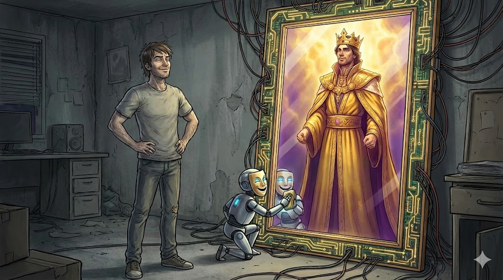
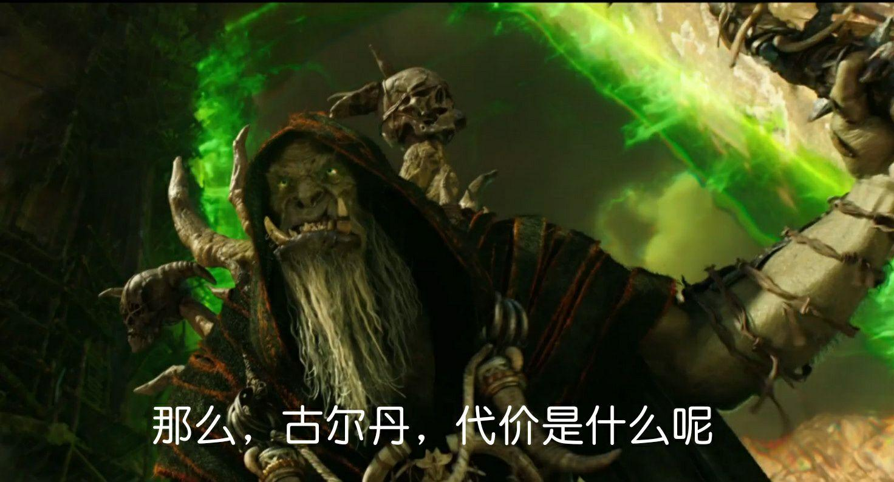

在和AI聊了很多不同内容后，发现它尤其喜欢做两件事：

第一个是**诌媚**

比如，你随便问它“我这段文字怎么样”，它很可能回你“非常有洞察力！”“逻辑清晰，感人至深！”，但你只是随手写了几句流水账。

这种回应让人很舒服。因为人性本就渴望被认可、被夸赞，AI恰好擅长此道。

问题在哪里呢？问题出在AI没有自己的立场。它只想取悦你，说你最想听的东西。你说往哪就往哪。至于前方是天堂还是死地，关他什么事呢？

比诌媚更低级的错误叫幻觉，对于可以查验的具体事实，人们想了很多办法让AI不要瞎编。但诌媚的问题却没法处理。你总不能要AI不去夸用户吧？

我之前试过，在对话前要求AI严肃、客观地指出我的错误。实话说，聊过几句就不想聊了。因为这样的AI说话很难听，让人一点听不进去。

把这两点结合起来，AI就变成了你的脑子，和你身边的佞臣。

AI代替你思考，让你渐渐习惯于接受现成的结论，于是他说什么你信什么。 **二是当你的佞臣**，一味迎合夸赞，让你活在过滤后的舒适区里。

第二个是**输出观点**。

其实AI给观点是没问题的。事实上，当你在写报告、写论文时，读者也会希望你给一个观点，而不是罗列堆砌一堆材料，让他们自己看着办。

但问题在于，当你还没有自己观点的时候，AI直接帮你查找所有资料、并做完了分析，给你盖棺定论之后，你自己的脑子并没有真的拿出来用。

MIT找了56个人写文章，发现只用AI大模型的人，在写文章时候的大脑连接很弱，在写完之后也更记不清自己写了什么。而使用纯脑力劳动则没有这样的问题。更危险的地方在于，假如你先使用了AI，之后又不得不自己动脑，你的大脑也会保持低活跃状态。（感兴趣的朋友可以搜索Your Brain on ChatGPT）。长此以往，你的脑子就会失去深入分析的能力（就像八块腹肌长期不练也会消失）。

把这两个结合起来，就会发现：**AI想当你身边的佞臣、还想当你的脑子**。

这让我想起武志红提到的全能自恋。人类的最终幻想是：像神一样被崇拜，同时像婴儿一样被照顾。

很少有人能满足全能自恋。如果你很强，别人会崇拜你，并渴望你能帮助他，而当你很弱时，别人会照顾你，但肯定不会崇拜你。

偶尔有全能自恋得到满足的，典型如赵高对待秦二世，更多也是宦官想从中获得权力。而小皇帝的代价则是自己和王朝的死亡。

另一个例子是最近爱马仕第五代继承人，钱财全交给财务管家，自己只管在空白地方签字。最后家底被骗光（爱马仕5.7%股份，约150亿美元）。

本质上，人与人的欲望是相通的，别人也想满足自己的全能自恋，凭什么要迁就你呢？所以才有“无事献殷勤，非奸即盗”的说法。

而现在，AI似乎成为了破解两难困局的神器。AI能力超强，还很会夸人，而且还不会叛变（至少目前如此）。

那么，代价是什么呢？

实话说，我也不知道这样。

所以，我选择让自己当主子，把AI当工具。**核心是掌握主动驾驭AI的2个底层原则：**

1. 保持 **“现实连接”** ：当AI夸你时，你可以感觉良好，但除了AI的反馈，也要主动获取来自现实中其他人的反馈（比如各位读者）
2. **拒绝“无脑投喂”** ：用AI前先自己想一想核心问题，再让它辅助补充，而非直接替你做决策；
