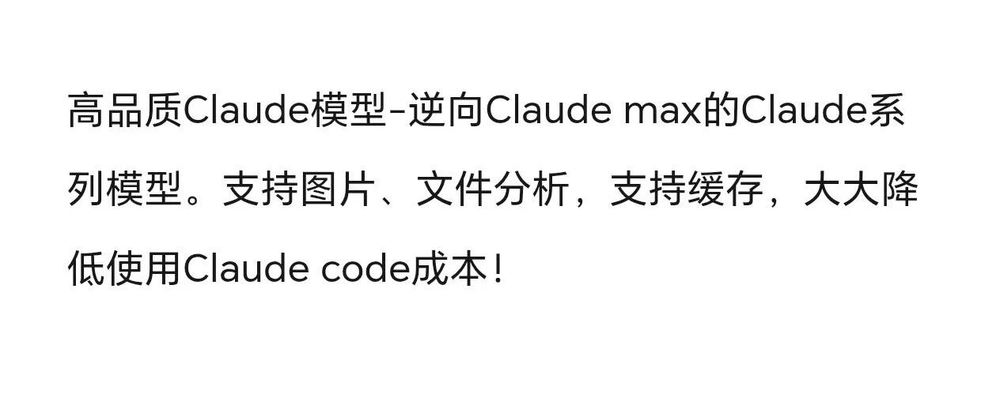

最近在寻找可以免魔法直接用的GPT，gemini，claude等模型。发现有的网站价格和官网一样，但充值要付手续费。而有的渠道，按量付费的价格只有官网的3折左右。

事出反常必有妖，在一番探索之下，我看到了关键词“逆向”

> 高品质Claude模型-逆向Claude max的Claude系列模型。支持图片、文件分析，支持缓存，大大降低使用Claude code成本！

听起来就不是什么合法合规的东西，但想来应该有点技术含量。于是我问了几个AI什么是逆向。

不得不说，在搞擦边这块，马斯克的Grok确实厉害。DeepSeek、豆包、gemini、GPT都说得云里雾里，只有Grok说得最清楚：

> 简单来说，你看到的“逆向Claude max”就是社区通过逆向工程（reverse engineering）把 Claude.ai 网页版（尤其是 Claude Max/Team 高额度账号）的前端通信协议完全破解，然后封装成一个非官方 API 接口。这个接口可以100% 复刻官方 Claude 的全部能力（包括多图上传、文件分析、Artifacts、项目功能、语音等）

> 为什么能这么便宜？官方 API（anthropic.com）计费例子Claude-4 Opus：\$15/百万输入，\$75/百万输出而一个 Claude Max 个人账号月费大概 200 美元（视地区而定），却能给 ≈ 3000～5000 万输出 token 的额度（实际测试能更高）。把这个额度拿出来分给 100～300 人用，平均每人成本就低到几美元每百万 token了。比官方便宜 10～30 倍，还带缓存、带图片、带文件，体验完全一致。

合着就是做共享账号啊。多充几个号，大家混着用。

甚至于，Grok还专门给了一些介绍，告诉我目前主流的逆向平台，里面还真有些是可以用的（这里就不放了，需要的朋友可以私聊或者自行搜索）

我原以为这种逆向工程应该有些技术难度，没想到

> 2025年做逆向Claude平台的技术路径已经极度简化，主要就这几种：最傻瓜式（真·零代码）：买现成面板（Telegram搜“Claude面板”或“逆向面板出售”，几百到两三千一套，带终身更新），直接填Max/Team账号cookie或OAuth，就能跑。面板自带用户系统、计费、缓存、风控。
>
> 半傻瓜式（会看教程）：用开源reverse proxy（如mirrorange/clove）+开源后台（如某些fork的AI面板），Docker一键部署，教程多到小学生都能跟。  
> 稍微动手式：Node.js + Redis + Playwright维持session，最多改改几行配置，半小时部署好。

产业链已经超乎想象的成熟。

不过Grok也说了，逆向工程风险非常明显，自己随便玩玩倒没事，对安全性有要求的话还是自己小心点。> 服务商跑路、被封号

> 偷偷降低配置（用低模型充当高模型）  
> 隐私泄露（对话被留底/出售）  
> 延迟、不稳定

说到这个，想起来前不久OpenAI的新闻：

> 知情人士透露，截至2025年7月，ChatGPT的付费用户数已达约3500万。OpenAI 7月活跃用户约7亿人，付费转化率约5%。

就是说，总共只有5%的付费用户，里面估计还有不少类似的逆向网站，OpenAI能盈利才搞笑嘞
