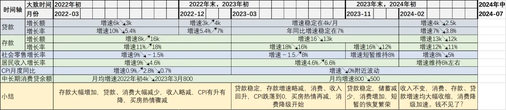
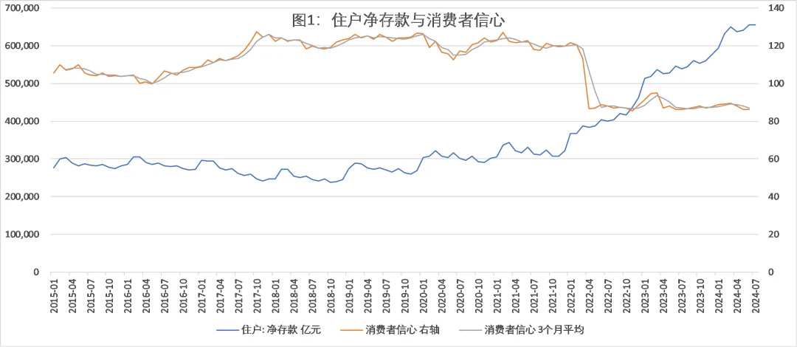
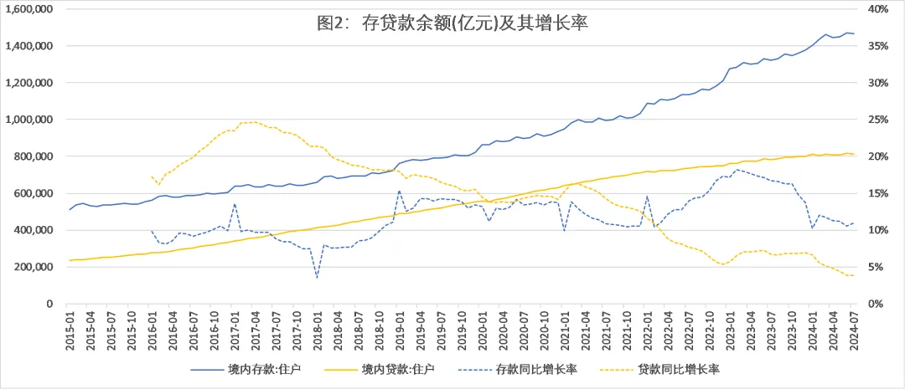
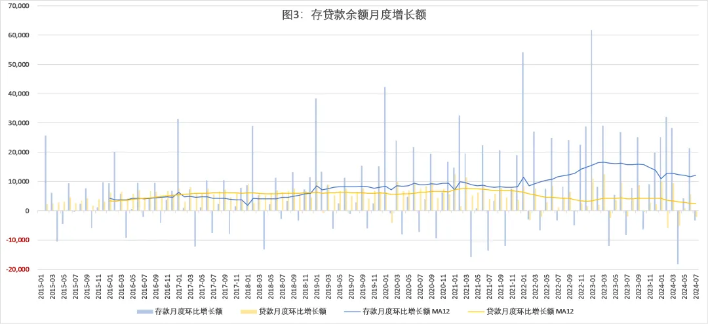
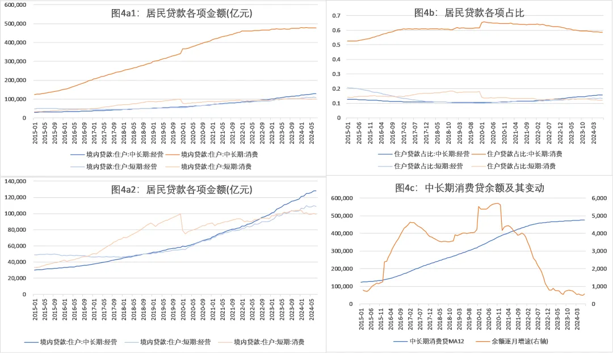
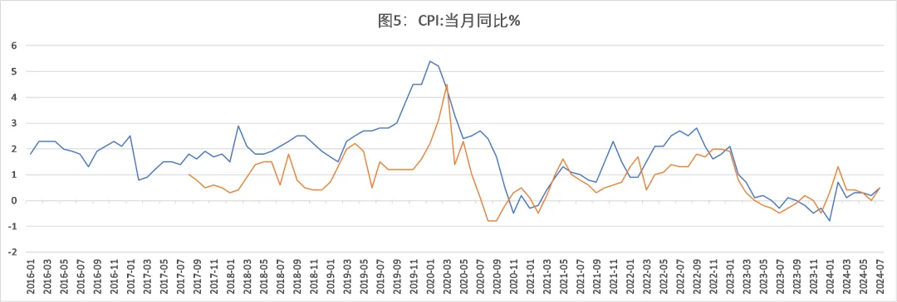
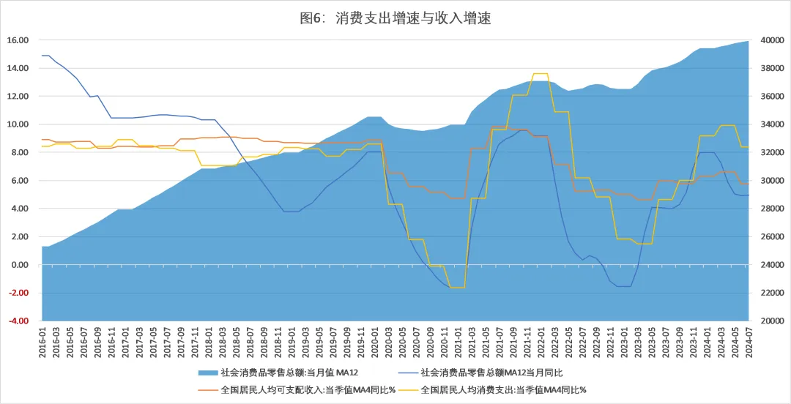
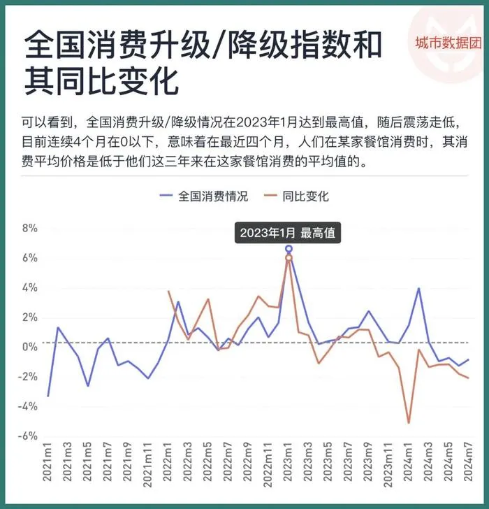

2022年初消费者信心骤降，大家开始逐渐转向"存钱模式"，到2023年初基本切换完毕。但所有人都存钱而不花钱的结果是没人能赚到钱，于是存钱模式只持续到了2023年末。从2024年2月开始，虽然收入增速保持不变，但存款、贷款、消费增速都开始下降。相当于既不存钱也不借钱，消费还在降级（于是就不理解到底赚的钱去哪里了，大概还是收入低了吧）

央行金融机构信贷收支表显示，居民净存款（存款-贷款）2022年之前大体保持在30万亿上下，2022年3、4月，居民净存款额开始大幅走高，从2022年初的36万亿增加到2024年中的65万亿，几乎翻了一倍。图1把存款数据和统计局的消费者信心指数放一起，可以看到消费者信心突然从120掉到85，时间高度重合。

净存款增长因为更多存钱，更少贷款。图2，存款同比增长率2022年前一直在15%以下，信心比较足的17、18年甚至低于10%（小尖尖是因为春节错位原因）。贷款增长率在2017年初达到25%的最高记录，然后开始稳步下降，终于在2022年2月与存款增长率持平。这之后贷款增长率下降趋势不减，而存款增长率开始持续提高，一进一出净存款当然迅速增长。很明显，信心减少改变了大家的储蓄行为，但贷款行为似乎没有特别大的变化？

并不是。图3显示了每个月存贷款余额变动额（柱形图是逐月的余额变动，线图是12个月的移动平均）。2019-2021年存款每月平均增加9000亿，贷款增加7000亿。2022年初贷款增长额开始下降，存款增长增加，与信心减少时间基本一致，也就是说前面贷款增长率减少，主要受高基数影响。存款增长势头持续约1年，到2023年2月，平均每月增加1.6万亿，是之前的两倍，然后终于涨不动了，之后存款增长慢慢减速，但仍然每月增长1.2万亿。贷款则一路下滑，到2022年12月，每月增加额仅3000亿，此后缓慢恢复到4000亿。

图4把贷款拆开，可以看出，贷款增长乏力主要因为居民中长期消费贷款几乎停滞。房贷是其中的大头，约占住户贷款的50%，或者占中长期消费贷的80%（图里没放）。图4c明显看出，在2017-2021年，中长期消费贷都稳步增加，月均增长4000亿，从2022年初到2023年3月，增速骤降至800亿，之后再逐渐降到2024年7月的500亿（这里使用12个月移动平均值，以平滑某些月份的极端波动，凸显长期趋势）。短期消费贷款在疫情之后也增长乏力，2020年初重挫之后一直难以超越疫情前的数据（图4a2）。只有经营性贷款还在稳步增长，让居民贷款余额不至于减少（但这难以判断小微企业和个体工商户经营好还是不好，生意好才增加借款扩大经营，或经营不善需要借钱）

大家都因为没有信心而多存钱，同时减少消费，最后的结果肯定是大伙都赚不到钱（因为一个人的收入必定来自另一个人的支出）。于是经济将陷入螺旋收缩。从图2看，大家的存钱势头大约在2022年3月左右开始，一直到2023年3月，推测这种螺旋通缩也从2022年3月左右开始，直到2023年进入一个低水平稳态。图5的CPI数据也能佐证这一点，从2023年3月CPI掉到0附近之后一直没有太大起色。

居民收入和支出的结果，却有些看不太懂。这里用社会消费品零售额数据（月度）和全国居民人均可支配收入、全国居民人均消费支出（季度）。因为社会零售额和收入、支出数据均有较强的季节性，且存在不少极端值，因此计算相应数据12月（4季度）的移动平均，MA12（MA4），再利用移动平均值来计算每个月的同比增长率，这样更容易看出大趋势。

图6可以看出，2022年2月到2023年2月，居民收入（橙色）、消费支出（黄色）和社会零售额（蓝色）都在下降，并且消费降幅比收入降幅大得多（和2020年有些类似，虽然大家的信心完全不同）。挣得少花更少，对应净存款大幅增加。（注：这里以社会零售额作为消费数据）

2023年2月-2024年2月，收入和消费重新恢复增长，于是存款增速开始放慢。但CPI仍然没有起色，也许说明大家的购买意愿并不强烈，没有推升市场价格，虽然在消费，但属于“消费降级”。之前城市数据团用收钱吧的数据测算过全国的消费降级情况，大概也是从2023年2月开始，餐饮和零售的消费不再升级，并且从2023年10月开始降级。（这篇推文微信上已经被和谐了，不过其他平台还有人转载，可以看得到）。

2024年2月之后，社会零售消费再次收缩，城市数据团的结果也显示，从今年2月开始，消费者不仅花钱越来越少了，花钱减少的幅度还越来越大。而同一时期，居民的存款、贷款增速都在减少，收入数据保持6%的年增速，而消费增速有5%。也就是说，赚的钱没变，但花掉的更少，存的钱也更少。

钱消失了？
