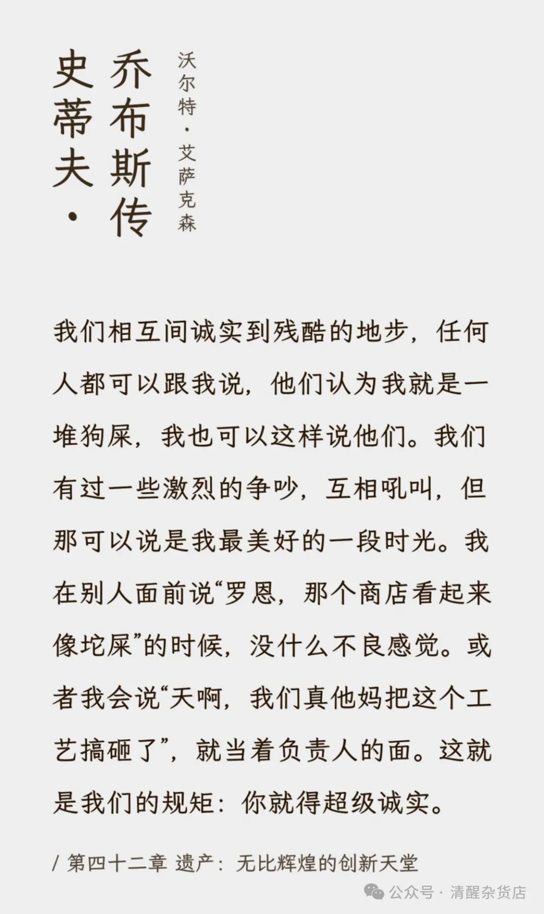

前几天去理发，被小哥说动烫了个头。

快结束的时候，店长和小哥开始一个劲劝我办卡。诚意是真的很足，优惠力度也很大，1000的卡觉得贵可以办500的，打折也按照更优惠的档次来，但自己就是不想办。

原因其实和钱没关系，纯粹是自己不喜欢这家店的氛围，每次去理发都觉得像是进夜店蹦迪，加上服务项目比较多，还担心被套路。但自己弯弯绕了半天，也没说出“我不喜欢你们家店的氛围和感觉”这个真实的理由，而只是说“担心办了卡用不完”之类的。

后来也在朋友圈问了一下，大家遇到这种情况，大部分都选择找点借口把对方打发掉，比如“没钱”，“女朋友办了”，“准备出家”，总之会找一个对方无法拒绝的理由，但并不是内心真实的想法（不喜欢你们店的氛围）。12个人里面，选择“打直球”的只有2个人。

沉默的成本

这种态度自己以前一直觉得没什么问题，甚至还“给人家留了面子”。但换个视角，这位店长因此无法意识到，自己店里嘈杂的环境和花样繁多的项目会导致某个顾客离开，而我自己也因此没法去临近且手艺不错的理发店。而如果表达自己真实的感受，也许他们会调整一番（至少会纳入考量）

于是整个事情看起来就很“扭曲”，而产生这种扭曲的原因，在于自己没有表达真实的不满。如果这篇文章就写理发店，那就太没有意思了。所以真正让我觉得“扭曲”的在于，如果作为顾客（甲方）的我都没能表达真实的想法，在其他场景下大概更不会。并且我猜，这种情况一定不止我有。

理发店办卡都弯弯绕，在工作中和同事/领导交流、在学校里和同学/老师沟通，有不满的地方能真实的表达出来吗？大概也不能，只能找借口推脱，甚至可能都没法表达不满，而是得假装好意接受。于是“扭曲”就产生了。

构建“好的社会”需要首先意识到现状有哪里不好，而如果没有真诚的表达自己的不满，世界当然也无法意识到问题出在哪里，更不必说协商调整。虽然不见得表达了不满就一定会带来改变，但引起质变需要先有量变，表达的人多了，才有机会让事情改变。而沉默则让内心期望的变化遥遥无期。

为什么沉默

道理都懂，但当真正遇到情况的时候，“不喜欢”就被卡住了，很难说出来。原因也很合理，因为表达不满会让对方“感觉不好”，并可能因此而受到对方报复。所以为了“避免麻烦”，不造成更大的损失，还是就算了。

那么为什么会形成这样的想法呢？为什么会觉得，说出对别人不满会让人不愉快？一个可能是从小接受的教导，不能当面说人家不满（会被看作砸场子），但归根结底，是因为自己听不得别人说自己哪哪不好，于是推己及人，也不对别人说，并把这种想法当做“真理”传给别人（如果自己真心相信说出自己的想法会让世界变得更好，大概也不会抵触别人吧）

记得有次回家过年，因为我不喜欢吃饭的时候闻到烟味，于是提请某个长辈不要抽烟（当然用的理由还是屋里有其他小孩子）。但这个行为就被理解为了“不尊重”、“挑战权威”什么的，并被教育了一通如何高情商地让别人不抽烟。在这种情况下，人当然很难直接表达真实的想法，而需要高超的技巧+小心翼翼的试探才敢发声。这种感觉当然很憋屈，背后其实是权力的争夺：当一个人开始说别人的不好，说话人就是在试图夺得话语权，要求对方按自己的意愿来做。

获得于是有了“媳妇熬成婆”的俗语。为什么要“熬”，因为当媳妇是痛苦的，没有话语权，得听婆婆使唤，只有当了“婆婆”，才能出头，获得话语权。

也许还有别的视角

但这场“权力游戏”原本是不存在的，只是因为“权力”这一概念种进了人的心里，才有了“争夺”：当别人不喜欢我的某些行为，就是在剥夺我的某些权力，并且操纵我。

这种观念如此根深蒂固，以至于我曾经一直都没有觉察出这是我内心的一种“想法”，还吧它当做客观现实来看待。直到前段时间看了《乔布斯传》，里面提到乔布斯经常会跟团队其他人发生激烈的争吵，互相痛骂对方的想法是“一坨狗屎”，但团队内的争吵往往带来更好的创意而非分崩离析。

当时我在想，也许用“狗屎”确实有点奇怪，但直接表达不满也可以带来更好的改变而非互相对立。关键其实在于如何看待对自己的批评。

最后附一段乔布斯的原话：

