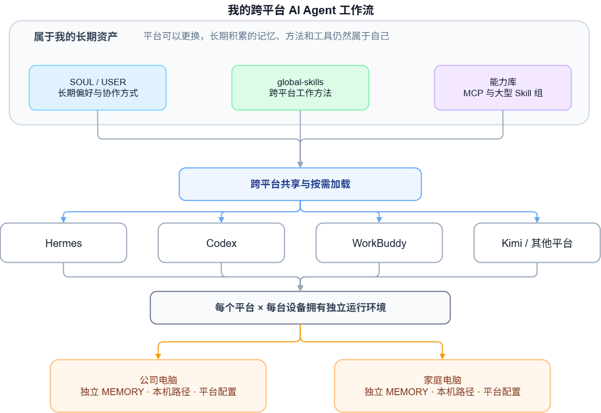
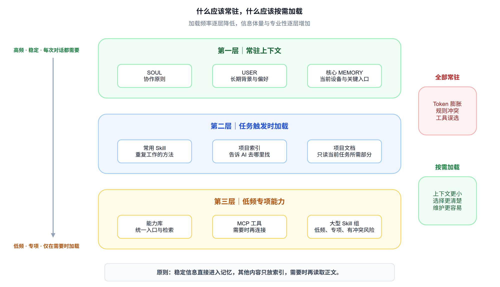
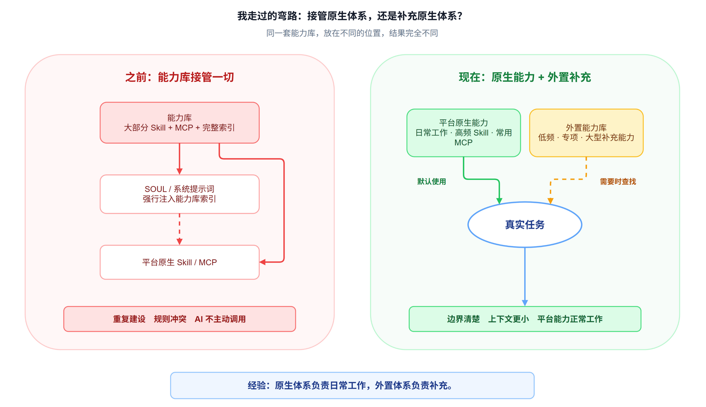

我现在同时使用 Codex、Hermes，偶尔也会用 WorkBuddy、Kimi 等 AI Agent 平台。

用久了以后，我遇到一个问题：每个平台都有自己的记忆、Skill 和工具体系。一个 AI 已经和我磨合了很久，换到另一个平台，又要从头开始。

这样很难真正比较哪个平台更好用。毕竟一个已经非常了解我，另一个连我是谁、用什么电脑、平时怎么工作都不知道。做生不如做熟，比较出来的结果也没什么意义。

所以我一直在折腾一件事：能不能把真正属于我的记忆、Skill 和工具独立出来，让不同平台都能使用？这样我可以继续积累自己的 AI 工作流，又不会被某个平台绑定死。

下面分享一下我目前的配置。它肯定还不完美，而且维护起来也不轻松，但确实是我实际使用、踩坑和调整之后留下来的方案。

## 一、AI 最重要的是了解我，但不能把所有东西都塞给它

我现在使用一套记忆三件套：SOUL、USER、MEMORY。

SOUL 主要描述 AI 应该怎样和我合作，USER 记录我的长期情况和偏好，MEMORY 记录设备环境、项目入口和一些需要长期记住的信息。除此之外，还有各种 Skill，告诉 AI 遇到某类任务时应该怎样做。

这些东西能让 AI 更了解我，但塞得太多也是不行的。

如果每次对话都把所有项目资料、所有操作方法、所有工具说明全部放进上下文，一方面费 Token，另一方面 AI 面对太多信息，也更容易选错工具、遵循错误的规则（甚至相互矛盾的规则）。

所以我现在的原则是：常用且稳定的信息直接放进记忆，其他内容只放索引。正文保存在本地文档里，需要时再让 AI 去读。

## 二、Skill：共享我自己创建的，保留每个平台内置的

因为我有两台电脑，每台电脑都有 Codex 和 Hermes，以后也可能继续使用其他平台，所以 Skill 最好能够跨设备、跨平台共享。

我选择的是网盘加软链接。

我在网盘里建立一个统一文件夹（`global-skills`），里面保存自己创建的 Skill，再让不同平台通过软链接接入。这样我只需要维护一份，所有平台都能使用。

一开始，我直接把所有平台的 Skills 文件夹合在了一起。后来发现这样问题很多。

每个平台都有一些自己的内置 Skill。这些 Skill 对其他平台通常没有价值，共享以后只会让上下文膨胀，还可能让 AI 选错。于是我把它们重新隔离：每个平台继续保留自己的 Skills 文件夹，只在里面增加一个 `global-skills`，链接到网盘中我自己维护的 Skill。

这样，共享的是我积累下来的工作方法，各个平台原生的能力仍然留在各自内部。

这里还踩过一个小坑。有些平台支持多层 Skill 目录，有些只扫描单层。例如 Kimi 只认识：`skills/某个skill/SKILL.md`​。如果变成：`skills/global-skills/某个skill/SKILL.md`，它就看不到了。

我的处理方法是，把 `global-skills` 本身也做成一个 Skill，里面放所有共享 Skill 的索引。这样即使平台不能直接扫描下一层，至少也知道这里有一份能力清单，需要时可以继续查。

## 三、记忆：稳定的信息共享，设备和平台信息分开

记忆比 Skill 更麻烦，因为每个平台的体系差别很大。

Codex 有全局 AGENTS 和项目级 AGENTS，也会维护自己的记忆；Hermes 使用 SOUL、USER、MEMORY 和外置记忆插件；WorkBuddy 的文件更多，还会在项目目录里创建项目 MEMORY；Kimi 目前的记忆功能则相对简单。

想让所有平台使用完全相同的记忆，实际上很难。

所以我现在以 Hermes 为主，在网盘中维护共享的 SOUL 和 USER。Hermes、WorkBuddy 可以直接通过软链接使用它们。

MEMORY 则不完全共享。两台电脑的程序路径、项目位置和环境配置并不一样，各个平台需要知道的信息也有差别。如果全部混在一起，AI 很容易拿着公司电脑的路径去操作家里的电脑。

因此，每台电脑、每个平台都有自己独立的 MEMORY，只共享那些长期稳定的人格、偏好和背景信息。

Codex 没有同样的 SOUL、USER 结构，我就写了一个脚本，把 SOUL、USER 和一小段 Codex 专属提示合并成一个 AGENTS 文档。为了让它知道自己在哪台电脑，脚本会分别生成公司版和家庭版，两份文件只有设备提示不同，其他内容保持一致。

至于 Kimi，目前确实没什么好办法，只能等它以后更新。

## 四、MCP 太多以后，我又做了一个能力库

除了记忆和 Skill，工具也很重要。

现在很多 AI Agent 支持 MCP。随着 AI 参与的工作越来越多，需要的工具也会越来越多。但很多平台会在启动时把所有 MCP 和所有工具定义一次性塞给 AI，避免它不知道自己能做什么。

工具少的时候没有问题，工具多了以后，上下文会明显膨胀。除了费钱，AI 还会因为选择太多而用错工具。

所以我做了一个独立的能力库，把重要但不常用的工具放进去。AI 遇到具体任务时，先从能力库里找到对应工具，再加载和调用。其他用不到的能力，平时几乎不占上下文。

能力库可以通过命令行调用，因此也能跨平台使用。同样一个工具，不需要在每个 AI 平台里重新配置一遍。当然，只要涉及电脑本地路径，两台设备仍然要分别处理。

后来我也把一些低频、专项、大型的 Skill 组放了进去。例如我曾经下载过一套包含近 30 个 Skill 的金融分析工具包，其中很多内容会和我自己创建的投资分析 Skill 冲突，但偶尔又有参考价值。把它长期放在常用 Skill 列表里会造成干扰，放进能力库，需要时再查更合适。

我还给能力库建了一个入口 Skill，叫 `capability-entry`。里面记录能力库有哪些 MCP、有哪些 Skill，以及应该怎么调用。不同平台只需要接入这一个入口，就能在需要时继续查找。

## 五、我也试过让能力库接管一切，后来发现太复杂了

之前我走过一段弯路。

当时我把大部分 Skill 和 MCP 都放进能力库，又把能力库索引直接链接进 SOUL，希望它能完整进入系统提示词。这样做相当于让能力库接管平台原本的 Skill 和 MCP 管理体系。

整个方案非常复杂，用起来也很难受。平台本来已经提供了一套能力管理机制，我又在外面重新造了一套，还试图让自己的系统覆盖它。结果经常出 bug，AI 也不一定能识别，更不会主动使用。

后来我把这套设计撤了回来。现在平台原生能力继续正常使用，能力库只保存低频、专项、体积较大的补充能力。某个任务确实需要时，AI 再去能力库里找。

这是我目前比较重要的一条经验：原生体系负责日常工作，外置体系负责补充。边界不一定永远固定，我也还在继续调整，但至少不再追求用一套系统接管所有平台。

## 六、AI 工作流也需要定期打扫卫生

这套配置还有一个经常被忽略的问题：熵增。

AI，尤其是 Hermes，会在工作过程中新增、修改 Skill 和记忆。大多数时候，它倾向于记录更多内容。一段时间不管，MEMORY 会越来越满，Skill 会越来越多，其中混着临时信息、重复内容和已经过时的规则，有些甚至会互相冲突。

这和家里长时间不收拾差不多。东西没有凭空消失，只是慢慢堆得到处都是，最后想找什么都困难。

让人手动整理这些内容很痛苦，所以我又做了一个“日常功课” Skill，专门规定怎样检查记忆、合并重复 Skill、清理过时信息，以及把零散步骤整理成完整工作流。我会定期让 AI 执行一次。

效果是有的，但仍然需要人工干预。负责整理的 AI 并不天然知道哪些信息对我最重要，它只能按照规则做初步判断。真正涉及删除、合并和长期取舍时，我还是会自己确认。“日常功课”这个 Skill 本身，也需要我根据实际情况不断优化。

## 最后

这一整套配置当然有成本。

软链接可能失效，平台的规则可能更新，记忆结构也可能发生变化。有时候我只是觉得 AI 最近怎么突然变笨了，回头排查才发现某个链接早就断了。维护它并不轻松。

但它最大的好处是可控。

我可以在自己的网盘里找到记忆、Skill 和工具，知道 AI 为什么这样做，也可以直接阅读和修改。即使以后更换平台，这些长期积累下来的东西仍然属于我。

现在整个 AI Agent 体系还处于很早期的阶段，每天都有新平台、新工具和新的做法。我也还在不断调整外置能力与平台原生能力之间的边界。

我希望最终积累下来的，是一套真正属于自己的 AI 工作方式：可以迁移，可以维护，可以随着实际需求慢慢生长，不会因为某个平台发生变化就全部推倒重来，不会因为换到新的平台而一无所有。

如果你也在使用 AI Agent，并且有一个真实需求不知道该怎么实现，或者已经搭了一套流程，但用起来总觉得不顺手，也可以来找我聊聊。你可以直接带着自己的需求和现有做法过来。我会先了解你实际在做什么，再一起看看哪些环节适合交给 AI、现在卡在哪里，以及有没有更简单的实现方式。

‍

‍
