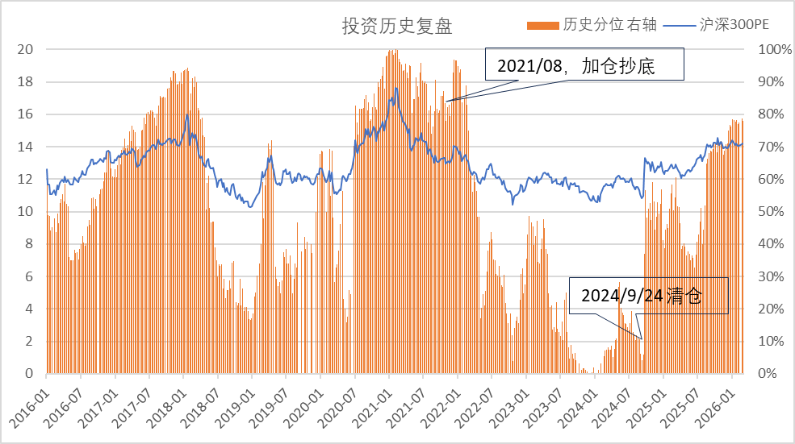
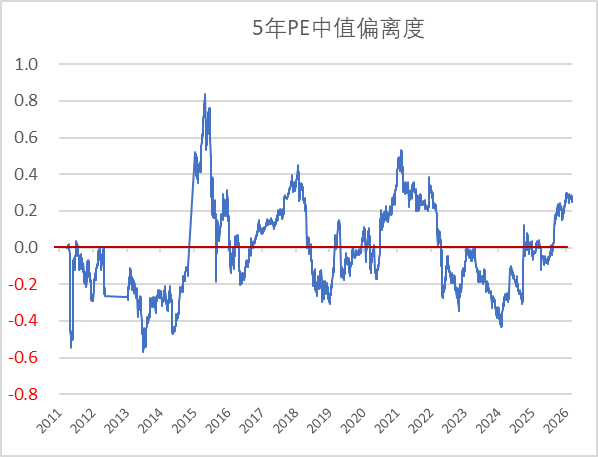

上一篇分享了我过去8年的投资经历，事后来看，我几乎是经典地买在最高处，卖在最低点。

为什么会干出这种蠢事呢？本质上是因为我在闭眼开车。凭借情绪和感觉，而不是对现实世界的认知来做决策。

于是我开始想办法睁眼看路。

我才发现，所谓"最高处"和"最低点"，很多时候不是完全看不出来，只是我当时根本没看。

## 抄底和逃顶很难，但"贵不贵"其实可以看

先打预防针，我并不觉得自己有能力判断市场的精准顶点和底部。真能做到这一点的人，可能也不多。

但这不意味着我们什么都看不出来。

顶部和底部很难猜，**当前位置大概偏贵还是偏便宜**，很多时候其实是可以观察的。

这两者差别很大。

我也不打算追求神仙操作：卖在最高点，买在最低点。  
现在我只求别太离谱：别在明显偏贵的时候热血上头冲进去，也别在明显偏便宜的时候情绪崩溃跑出来。

下海之前先看水位。回头看我自己的投资经历，最大的问题不是没猜中拐点，而是连"现在大概处在什么位置"都没认真了解。

所以现在我强迫自己，不能凭感觉，必须要有数据支撑（虽然不总是靠谱，但比一点谱没有要好）

## 第一个指标：PE分位

我最先开始看的，是PE。

PE这东西不复杂，简单理解，就是市场愿意给企业多少倍的盈利定价。  
但对我来说，更重要的不是"当前PE是多少"，而是：**它放在历史里，大概处在什么位置。**

不看不知道，一看拍大腿。

当初我抄底时，PE正处于过去5年的90%高位，而我在卖出的时候，已经只有6%了。

从估值上看，当我以为抄底机会到来时，我其实还在山顶旁边一点点，当时的市场其实一点也不便宜。而在我觉得市场没救时，它已经悄然来到了谷底，往哪个方向都是上坡。

## 第二个指标：PE的离谱程度

光看分位值，信息量有限，90%分位值算很离谱吗？说不上来。于是我又计算了个"离谱值"。具体来说，是计算当前PE和过去五年中位值的偏离程度。

偏离度=log(当前值/中位置，2为底)。

在2018年的高点，估值的离谱程度也只有0.4，2015年市场最疯狂的时候，离谱值大约是0.8。我想抄底时，离谱值大约也是0.4。

而在我离场时，离谱值大约-0.3。看起来还是我比较离谱。

看到这里，也不能得出什么神奇结论。

PE低，不代表明天就涨；PE高，也不代表立刻就跌。市场不是按指标按钮运行的，更不可能靠两个数就被完全看穿。

但这些数据至少能帮我少犯一种很蠢的错误：**把自己的感觉，当成对现实的判断。**

这不是什么高深的方法，只是先把眼睛睁开。
