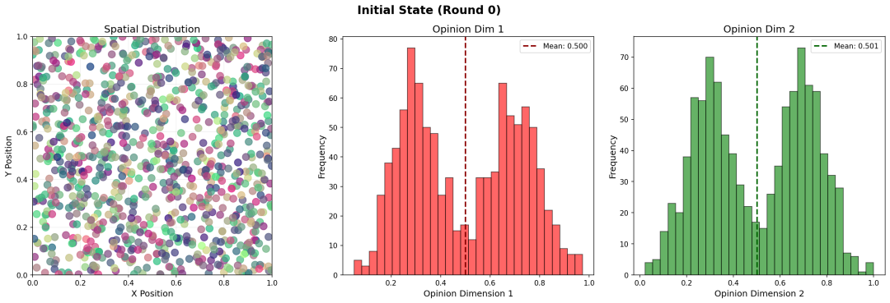
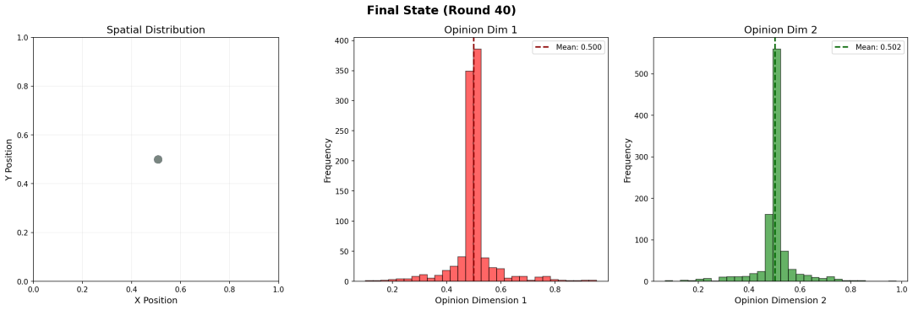

前两天和妻子聊到个性化推荐，她分享了一张图让我很受启发，于是决定做个模拟分析。个性化推荐常常被指责会导致信息茧房，而长期沉浸在同质的信息中，又会导致人变得固执、极端。

我们可以看到的是，现在的个性化推荐系统无处不在，同时，我们也经常能看到/听到不同群体之间观点对立严重、社会分化加剧的新闻（甚至自己有感受）。

现象有了，理论解释也有，很自然的推论是：**个性化推荐导致社会对立**。

我很想看看这个过程是如何具体发生的，于是我做了一个简单的数值模拟程序，来展示个性化推荐如何让一群原本观点平和的人，逐渐变得固执、抱团。

核心设定包括：

1. 在所有可能接触到的个体中，与自己观点越相似，接触的可能性越大
2. 自己的新观点=自己的旧观点+接触到的新观点均值
3. 人会想要朝与自己观点相似的人移动

结果非常有意思。

无论我如何调整模型参数，经过多轮迭代之后最终的结果都是：原本分散的观点都集中到了平均值位置，所有人都变成了中间派，而不会产生任何分裂。即使一开始存在观点对立，但最终都会达成共识，并抱团在一起。

说明：初始观点随机分布在0-1（例如，在多大程度上支持动物权利），服从双峰分布，初始两个峰分别是0.3和0.7，均值0.5。设定每个人有2个互相独立的观点维度（例如，是否支持动物权利、是否支持自由市场）。两个维度的观点分别用红色和绿色表示（这样设置主要是为了颜色好看）。为了模拟物以类聚，我还设定了每个人的位置，初期在整个空间内随机均匀分布，并会向与自己观点最近的一群人靠拢。最后的结果是所有人都聚合到了同一个中心位置，拥有同样的观点，而没有产生任何分化对立（变成了灰色，因为50%红+50%绿会混合出灰色）。

一开始我很不理解，觉得肯定是哪里弄错了。

后来仔细想，也许个性化推荐根本不可能导致观点分化。原因非常简单，个性化推荐只是推荐和你观点相似的内容，但**个性化推荐并不会引导你认可什么**。

假设一开始社会整体的观点保持中立。而个性化推荐算法的意思是，让我更多接触和我观点类似的其他观点。我是一个稍微左派的人，我能够接触到的是和我差不多的左派，我看不到右派的观点，但我也不会想要变成极左分子。

因为我略微偏左，所以整体上，比我更右倾的人会多一些，我就更容易受到左派中的右派影响，从而逐渐向中性靠拢。同样的，一个右派也会向中性靠近，于是社会整体就向中间派集中，观点差异消失了。

那么，是什么导致人群的观点分化呢？更可能的答案是现实处境。毕竟，屁股决定脑袋，人的观点最终受到所处的环境、利害关系所决定。如果鼓励市场自由竞争的政策会损害我的利益（比如导致我失业），那我肯定会反对自由市场，赞成政府管控。这个和信息茧房、和个性化推荐，半毛钱关系也没有。

一个原本和谐的社会逐渐分裂，本质上是不同人群的利益冲突加剧，而和个性化推荐、信息茧房关系不大。利益冲突是柴，是火，个性化推荐只能算风。没柴没火的时候，风怎么吹也不会烧起来的。

那么利益冲突是怎么来的呢？这就是一个更复杂的问题了。
