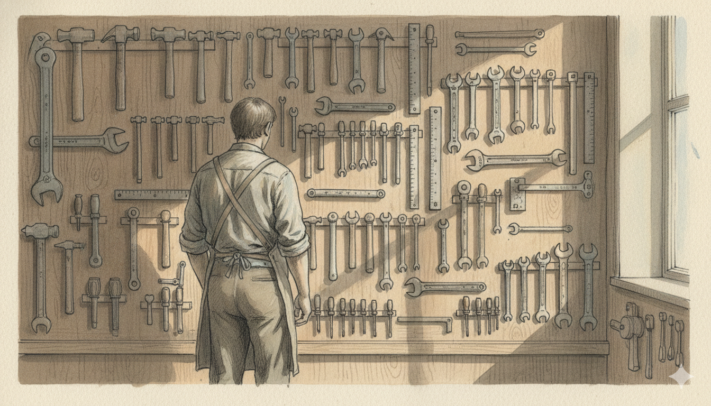

最近几个月，感觉自己对AI编程着魔了。Cursor, Claude code, Skill, Clawdbot......

看啥都觉得要起飞了，自己得抓紧跟上时代。

老婆说想有个网站放自己的画，我让AI搓了一个带前端、后端、数据库和图床的"全栈项目"；

想清理Excel里杂乱的上市公司数据，让AI写个脚本自动对齐A股、美股、港股的财报；

想追踪行业新闻，用AI写爬虫，让它每天自动搜集整理新闻并总结给我；

甚至觉得思源笔记里的AI插件不够厉害，想让AI给我做一个能读懂我所有笔记的"第二大脑"。

‍

听起来都挺厉害，但说实话，这些项目里，真正**派上用场的没几个**。大部分时候，我都**只是在"玩工具"** 。

就拿给老婆做网站这事来说。她想要一个审美在线、能轻松展示和分享画作的网站页面。我觉得有了AI，可以从零开始建站。研究前端框架、配置后端数据库、设计密码保护，折腾了一个多礼拜，token花了100多块钱。做完很得意地给她看，她礼貌地说"挺好，就是有点丑"。但后来我发现，她真正在用的，是在Canva做出来的网站。毫无技术含量，但审美在线。

我做了个拥有"代码主权"的项目，但她需要的，只是一个能分享美的窗口。

‍

做Excel数据清洗脚本时也一样。我想对齐不同交易所的上市公司数据，为了追求"高扩展性"和"全自动化"，让AI写了各种复杂的匹配逻辑。花了好几天，程序还是跑不通。那个"完美"的脚本，至今还是个半成品。也许把这个时间用到Excel上，我早已经把数据整理完毕，开始做后续分析了。

‍

最典型的是那个新闻爬虫。有个网站总是弹人机验证，我决心让AI写个"智能验证器"。我指挥AI：检测特定元素，计算按钮位置，自动点击，还要持续监听验证是否完成……为了这个"完美方案"，我耗了一整天。直到脑袋发胀，我才突然想到：我真的需要它这么"智能"吗？

我放弃了。改为预先标定固定的按钮位置，依次尝试2秒、5秒、10秒几种点击时长。这个"土办法"，只用了半小时就搞定，至今运行良好。

‍

我掉进了一个"工具论陷阱"。手里有了AI这个强大的工具，看什么都想用它"搞一下"。技术很刺激，过程很有趣，但做完了才发现：工具很好玩，但问题没解决。

‍

**所谓磨刀不误砍柴工，"工具论陷阱"最大的坑，是光磨刀，不砍柴。** 我想用AI辅助写作，我输入灵感，它能根据我过去的文章，按我的风格自动补全。为了这个目标，我找到了思源笔记，和里面的AI助手（Copilot插件）。

刀有了，该干活了吧？没有。我觉得这刀不够快。于是我开始用AI编程，改造一把更厉害的刀，做一个更厉害的插件。结果我沉浸在"改造工具"的快乐里，一篇文章都没让AI帮我写出来。

我围着工具打转，却忘了最初只是想写点东西。

‍

几次折腾下来，我有点明白了。对于我们这种非技术极客的普通人，想把AI用好，或许不该想着"追踪时代前沿"。而是先问问自己：需求是什么？有更简单的解决方法吗？

别让技术的可能性，掩盖了需求的必要性。AI编程容易诱发"技术完美主义"，总想做出健壮、优雅、可扩展的解决方案。但现实中，"能用"的方案才是有价值的方案。

‍

于是我开始调整自己和AI的关系。我不再追求用AI做出多么高级的东西，不再想着发挥AI的最大价值。而是回到问题的起点：我当下最具体的烦恼是什么？AI能不能用最简单的方式帮我缓解它？

可能是用5分钟让AI写个Excel公式，从表格里提取某个数字；可能是让AI把一篇长文总结成几个要点；也可能，我根本用不上AI。

至于那些高级、精密、能让我感觉"很极客"的项目，我依然会做，但只当成一种娱乐。就像有人周末去钓鱼，我周末"玩AI"。

你是怎么用AI的？有没有也掉进过类似的陷阱？ 欢迎在评论区分享你的故事。
