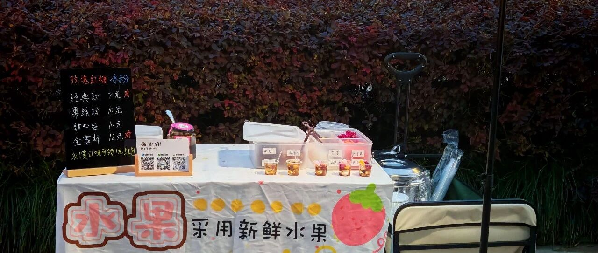
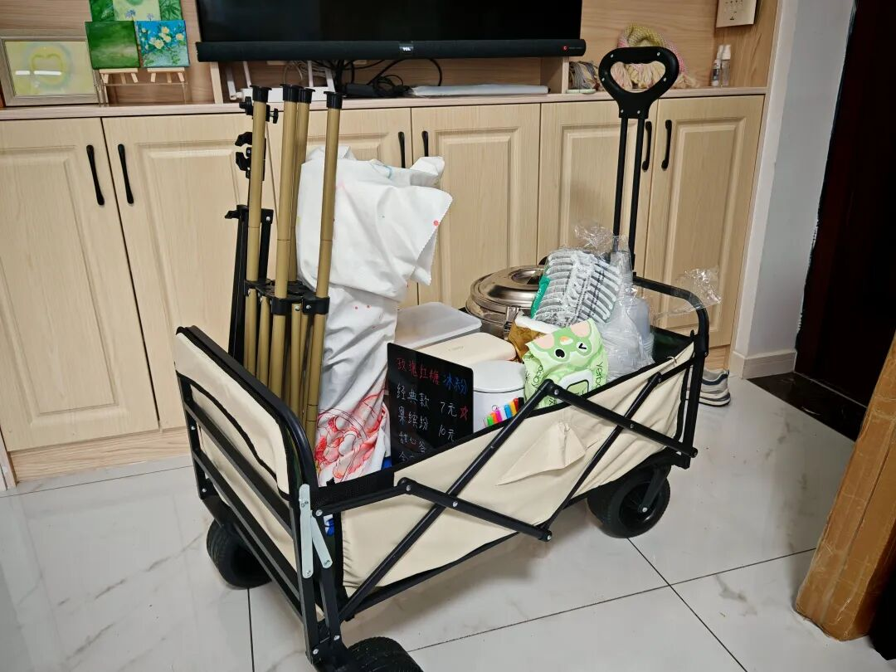
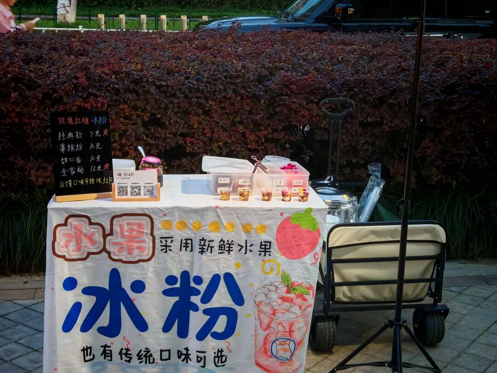
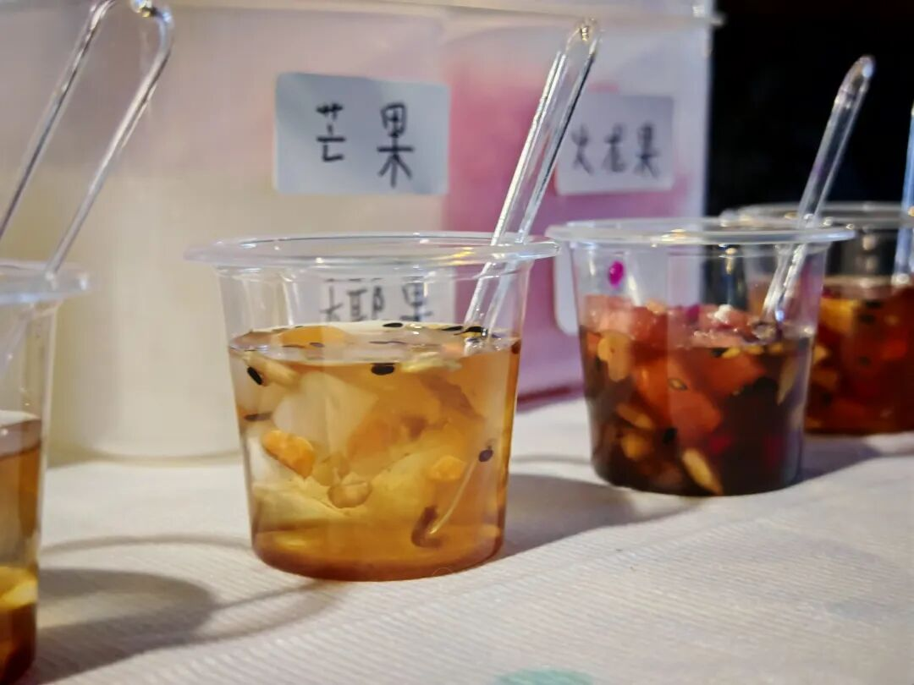
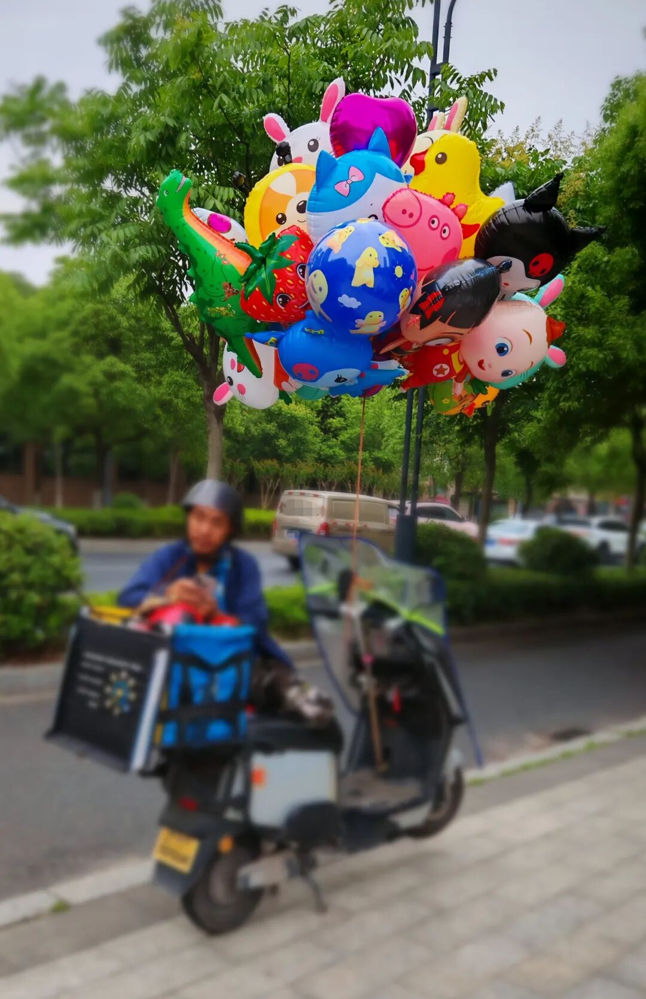

以前经常和朋友调侃说："大不了就去摆摊。"听起来像个笑话，没有人真打算付诸行动。毕竟都是浙大的学生，还是金融学专业，怎么看都不像是去街头摆摊的人，身边的同学也没有人真去摆过。这种事在我脑子里一直是个模糊的概念，直到上周末，我真的去摆了两天地摊。

摆摊装备

为什么想去摆摊

因为工作性质，我大多时间和电脑打交道，跟人接触很少。久而久之，产生了一种"与现实脱节"的感觉，好像和真实的物质世界没什么关系。我想找回那种"接地气"的触感，之前试过做饭、爬山，现在准备拓展新地图：摆摊。

在公司里，每个岗位通常只做链条上的一小段，项目的整体脉络并不清晰。摆摊却要求我亲自负责所有环节：选品、定价、备料、销售，每个细节都得自己决定。

所有的决策都依靠自己来做，没有人给我提任何要求，也没有人兜底负责，意味着我的所有行动，全都出自我的意志。于是当这件事最终落地后，我可以体验到自己的意志得到伸展的力量感和成就感。

这种力量感和成就感是打工所难以获得的，因为打工通常意味着自己执行的是别人（比如老板、领导）的意愿，自己的意愿则是间接的。这也是指使别人（比如花钱买）所难以获得的，因为没有参与过程，自己只得到了结果。

最后，我也想为自己寻找一条工作之外的备选路径。万一哪天需要换个活法，至少知道还有这种可能。与其天天操心经济下行、降本增效、毕业优化，不如给自己找点事做。

尽管有这个念头很久了，真正行动却拖了好几个月。怕做不好、怕赔钱、怕别人笑话、怕顾客刁难......这些担心在脑子里打转。但脑子里那个"我要去摆摊"的声音在我每次做瑜伽时都缠绕着我、让我分心，我知道，自己必须要行动了。无论如何，先干了再说。

确定卖什么

我先考虑进入门槛低、自己能做出来的品类。小商品要铺货，排除；烧烤炸串设备太贵，排除；最终锁定家乡小吃春卷。和家人聊过之后，又获得了新的建议：卖冰粉，理由是制作更简单，利润也更高。在老家一杯冰粉能卖6元，一份春卷只有2元。

五一假期，我顺便在市集做了市场调研。发现小吃多集中在炸串、烧烤这类重口味产品，而春卷这种"减脂风"可能不太吃香。此外，杭州的集市摊位，零食价格在5-10元，饮料在10-15元，于是最终决定卖冰粉。

但真正开始准备后，发现细节极其繁琐：冰粉是自己搓还是买冲调粉？SKU怎么设计？怎么定价？摊位怎么布置？甚至还纠结怎么记账会比较符合上市企业财务会计准则。这些问题一度让我卡壳，尤其是作为学经济金融的我还在试图"一步到位"，寻找利润最大化的最优解。

最后，"先把业务上线"的理念取代了"利润最大化"，成为了行动的指导纲领。一切从简，能买现成就不自制、原料成本不离谱就行，味道不差就行。草台班子终于搭起来了！

出摊实录

周六正式出摊。冰粉按预定比例冲好，中间还遇到放大产量导致成品状态不稳的问题。各种小料装盒，为了精确估算物料成本，还用0.1g精度的电子秤称了好几轮。东西备齐后，又折腾了一阵怎么装车。

等到晚上6点才出摊，刚支好桌子，第一个顾客就来了。此前曾幻想着，对于第一个顾客，我可以给什么问候、福利等等，结果等我打开桶准备舀冰粉，发现没！有！勺！子！给我笑傻了，只能临时拿碗应急。预想的福利问候也全都没有，甚至还忘了加必备红糖水。

那一刻我对"草台班子"的含义又多了一点理解。

第一天的摊位

周六晚上2小时，周日下午2小时，总共卖了12碗冰粉，收入125元（含自购一碗）。不算设备投入，只看食材成本勉强持平。主要因为切好的水果、拆封的小料没卖完只能丢弃，说起来都是利润，干下来都是亏损。

不过看到几位顾客（一般是7-12岁的小孩）因为冰粉而开心激动、欢呼雀跃搓手手的时候，"市场价值"这个抽象的概念逐渐变得具体起来。

收摊复盘

最大的收获不是钱，而是现实的反馈。

以前我以为装修形象好看顾客就会来，但干净形象是有隐形成本的，我刚开始戴着手套出餐慢，有顾客甚至自己上手打包。我也曾以为免费试吃能带来很高的转化，现实是试吃顾客中，大部分吃完就走，转化率只有30%。选址也很有讲究：我以为小区旁边有孩子的公园会人气旺，结果发现孩子太小，家长根本不敢买。

小杯试吃装

反倒是公园旁边卖气球的大叔给我上了一课。

大叔看起来约摸着50岁，面色红黑，应该是常年风吹日晒的结果，和穿着白T恤白帽子、面前白桌布的我形成了鲜明对比。

他通常在下午5点到7点出现在公园入口，骑辆电瓶车，车龙头绑一大把升空气球，后备箱还支出一根鱼竿，吊着只电动玩具鸟，吱吱地叫唤。以前下班路上也见到过几次，但觉得他卖的玩具看着很粗糙，气球也毫无设计感，于是从未停下来过。这次摆摊，他就在我旁边，我眼见着公园的家长，10元一个气球买得毫不犹豫，而对我的冰粉摊则毫无兴趣。不到一个小时，他就卖了100多块钱，可比卖冰粉来钱快多了。他还跟我分享经验，告诉我附近哪里的公园人多，他之前在那里卖气球"几百块钱一会就有了"。当然，改进也是有的，和第一天相比，至少准备工作变得熟练了很多，客户画像也比之前在头脑里的想象要更加清晰。想来大叔选择在那个时间、那个地方、以那个价格卖那些东西，应该是经过长期优化之后的结果，生意比我这个愣头青第一次摆摊好也非常合理。

摆摊没有想象中浪漫，也没有赚到钱，但我知道，我还会继续。下次，我会记得带勺子，也会记得火龙果先切半个（剩半个留家里自己吃）。

欢迎你来光顾不断优化的冰粉摊。
